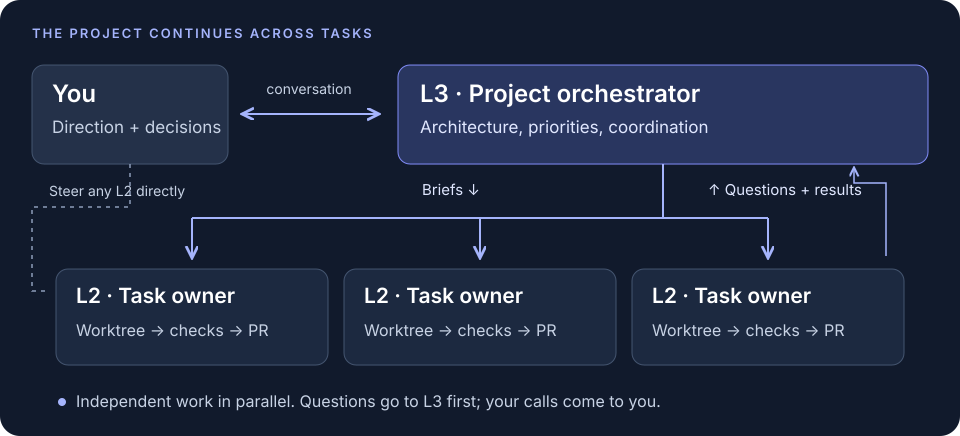
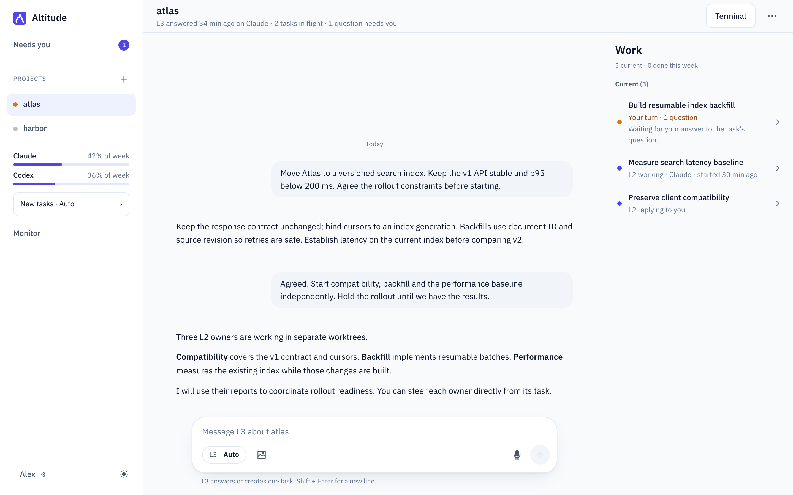

# Altitude

**Persistent project orchestration for coding agents.**

Altitude gives each software project an ongoing conversation with **L3, its project
orchestrator**. Discuss architecture, priorities and what should happen next. L3 dispatches
**L2 task owners**, each responsible for concrete work from its brief through checks and a PR.
You can talk directly to any owner while the work runs.

Several tasks can move forward in isolated worktrees while L3 keeps the project direction in
view. Questions go to L3 first: it answers from the brief, repository docs and recorded decisions,
and brings you the calls that need your judgment. Task reports preserve delivery outcomes;
reports needing follow-up return to the project conversation, where you decide what comes next.

**Engine-agnostic by design.** Codex and Claude Code are supported today; further CLI engines are
part of the [roadmap](docs/ROADMAP.md#engines-platforms-and-distribution). Each integration connects
the engine's native sessions and tools to the same project and task workflow.

<picture>
  <source media="(max-width: 600px)" srcset="docs/images/orchestration-phone.svg">
  
</picture>

## One project, several fronts of work

You are moving **Atlas**, a search service, to a versioned index. Existing clients must keep
working, backfills must resume safely, and search latency must stay within budget.

In the project conversation, agree the API contract and rollout constraints with L3. Then ask it
to dispatch the independent work: **client compatibility**, **resumable backfill**, and a
**performance baseline**. Each gets its own L2, brief, expected files and worktree. The performance
owner can measure the current system while the other two implement against the agreed contract.
L3 uses the results to coordinate the next rollout task.

<picture>
  <source media="(max-width: 600px)" srcset="docs/images/project-phone.png">
  
</picture>

*The actual web app, rendered with fictional projects, messages and session data. This is an
illustrative engineering scenario, not a recorded delivery. [Open the captures and walkthrough](docs/WALKTHROUGH.md).*

[Full-size desktop](docs/images/project-desktop.png) · [Phone](docs/images/project-phone.png)

Open the compatibility task and tell its L2, “Keep pagination tokens valid across the cutover.”
Its durable conversation sits beside the live engine session. Meanwhile, the backfill owner's
retry question goes to L3, which answers from the agreed idempotency rule. A different question
— whether to retain the old index for seven or thirty days — needs your cost and rollback
judgment, so L3 escalates it to **Needs you**. The other work can continue.

The owners deliver separate, checked PRs. A merge hold leaves a PR for your review; otherwise an
owner can merge after the applicable checks and review. L3 can inspect the reports and handle
follow-up, so the next discussion can address rollout readiness with the work in view.

This repository temporarily uses verified local `make check` runs for PR delivery under the
operator's 2026-09-09 Pacific decision. Landing tests the current merge candidate, retains its
evidence, including captured output on timeout, and adds the passing candidate SHA to the PR.
Timed-out validation keeps the gate failed. Hosted CI is suspended; review and merge
holds still apply. Other projects keep their own gates. See
[local validation and CI restoration](docs/DEVELOPMENT.md#ci-and-candidate-identity).

Launches, landing and restart builds preserve Node already on PATH. When it is absent, they
use the installed nvm default and its package-manager shims without loading shell profiles.
New archive installations save the discovered tool path for their service.
Candidate dependency installation runs inside `web` so Corepack reads its pinned pnpm version.
See [toolchain setup](docs/DEVELOPMENT.md#noninteractive-toolchain).

One active task can deliver several PRs. When authorized work remains after a merge, the same owner
continues in its existing conversation and worktree and runs `alt land` again. It puts only the
follow-up changes onto current main and opens another PR, with its own checks and review holds.
Running it without new work creates nothing. Earlier deliveries remain recorded, and the final
report covers all of them. See [continuation after merge](docs/CLI.md#continue-after-a-pr-merges).

A reported owner with an open PR remains reachable in its task conversation. Send a follow-up to
continue that owner's session, attempt and worktree with the same PR, objective and review holds.
L3 can also request continuation with `alt task resume <slug> --reason "…"`. The previous report
stays in task history. Every resumed code-owner turn rechecks delivery and writes a fresh report,
including replayed guidance that adds no work, retaining all deliveries and exact remaining scope.
A chat acknowledgement cannot complete that turn. A saved message is not proof that the
worker has restarted: capacity and recovery waits remain visible. Done, archived and rejected tasks
remain read-only; reopening their lifecycle is a separate, unsettled product decision.
An exited worker whose transient unit has been collected can resume once systemd confirms it is
inactive; unavailable or ambiguous status keeps the task blocked to prevent overlapping workers.
Temporary project setup contention keeps launches queued and authorized resumes pending. The daemon
continues after the setup lock is released, preserving the saved session, messages, questions and
merge holds. Actual setup or worktree provenance failures still require verified recovery.

Large or complex issues can move through small, reviewable increments that keep supported user journeys
working. L3 records the breakdown and delivery evidence in the issue; each task completes its agreed
increment, and follow-up work can come later within the operator's authorization. The parent stays open
until cumulative delivery satisfies its full scope and required acceptance. See
[incremental delivery](docs/CLI.md#incremental-issue-delivery) and
[issue closure and reconciliation](docs/CLI.md#delivery-linked-issue-completion); merge holds still apply.

L3 completes authorized superseded-PR cleanup with [`alt pr close <number>`](docs/CLI.md#superseded-pr-closure).
L2 hands over authorization and replacement-delivery evidence; L3 verifies that scope before closing.
The command targets the project's repository, retains branches, and returns the verified PR state
and URL. The operator can use the same verb. Unconfirmed results remain explicit.

An assigned task can also [adopt an existing PR](docs/CLI.md#adopt-an-existing-pr) created outside
Altitude: `alt land --adopt-pr <number> --expected-head <full-sha> --reason "…" --message "…"`.
The owner inspects and incorporates its history in the task worktree first. Adoption records that
specific PR and original head. Commit messages need no ownership labels or repair. Updates go to
the original PR branch through fast-forward pushes, and a checked, reviewed `--merge` preserves
commit history without requesting branch deletion. An explicitly assigned next PR can be adopted
after the previous merge and its preserved history are verified on main; earlier receipts remain
immutable. Checks bind to the current base and head. Nonrequired skipped checks do not block delivery;
required checks must succeed, and hosted CI needs at least one actual success. Failed or pending
checks still block. Task scope and merge holds still apply.

Operator decisions in task chat, project chat and the UI authorize delivery within their actual scope,
including routine integration. L3 applies [recorded merge approval](docs/CLI.md#recorded-merge-approval)
to each held PR after reviewing the original source and later corrections. The daemon verifies
authority, question evidence, the hold and PR identity; the owner completes review and current-candidate
checks. Each held follow-up needs its own scoped release, and a renewed hold requires approval of that
renewed requirement. Design feedback, unresolved conditions and revoked permission cannot authorize merge.

## How the work stays coherent

- **Project continuity.** One persistent L3 conversation holds direction across tasks. Discuss
  tradeoffs, change priorities, or return after delivery; follow-up and escalations feed back
  into that conversation.
- **Coordination and durable feedback.** L3 tracks the roadmap and next steps, and sends owners
  sourced updates when their current work is affected. It handles authorized continuation,
  persists reusable feedback through the task/PR path, and recommends scoped corrections for
  missing capabilities. It uses judgment about who needs context and when. The
  [L3 persona](personas/l3.md) owns these responsibilities; its reports distinguish queued,
  merged and effective changes.
- **Direct ownership.** One L2 owns each task end to end. Message it directly, inspect its live
  session, and follow its PR and report. A replacing public update and recorded activity show what
  is visible from the current worker. Messages stay separate and individually removable while waiting
  for the engine's next checkpoint, which takes the remaining batch in arrival order. Sending and
  uncertain handoffs cannot be removed; delivery is labeled only when evidenced. Stop holds queued
  messages until an explicit correction or Continue
  resumes the saved session; file edits and the draft remain intact.
  Steering accepted before a clean completion is finalized keeps the owner reachable for the next turn.
  An explicit question block survives worker exit and restart; older queued messages do not
  resume it. A later message or explicit Resume brings the session back.
- **Independent execution.** Briefs describe the problem, outcome and material project constraints;
  brainstorming stays tentative. Owners choose the approach and account for relevant system
  implications, including how to investigate, implement and use native helpers.
  Worktrees isolate changes; planned files guide coordination. Owners review selected changes and
  all outgoing history for scope and privacy before `alt land` publishes through their assigned PR.
  Shared-file changes still need rebasing and reconciliation by their owners.
  Builds, tests and installs inside the workspace run autonomously. A change the workspace or
  sandbox cannot make, such as a service configuration, needs the operator's yes to one concrete
  purpose; the recorded grant then lets the owner run commands through Altitude outside its sandbox,
  with each command and its output recorded on the task, until the purpose is done or the grant is
  revoked. The owner never hands terminal commands back to the operator for authorized work.
- **Selective attention.** Needs you collects unresolved dilemmas in clearly named project sections,
  with each project's items together and full project names wrapping when needed. Each item
  makes the task's purpose and actual choice clear with one question or a small group together,
  concise actions, and the material consequences needed to answer. Detailed reasoning and history
  stay accessible in the owning conversation. The model can ask a plain question, offer one
  recommended quick action, or offer two to three choices with a recommendation. **Other…** opens a
  small field beside that question; plain questions show it directly. **Send N answers** submits any
  mix of choices, custom answers and follow-up questions, with nothing preselected. The send row
  follows the questions and scrolls with them on phone and desktop. Sent members show
  **Sent to L2** in the conversation and leave the attention count; remaining members stay answerable.
  The L2 interprets every response: “21 days” supplies a direction, while “Why seven?” invites discussion.
  Sending saves the response; its meaning determines what is agreed. Ordinary chat retains voice input;
  question fields accept text. When guidance reaches the owner, it
  checks each question before lengthy analysis: valid choices stay visible; doubtful ones are withdrawn
  with a reason in chat and re-asked when ready, even with identical wording. Independent questions stay
  answerable. A clear answer settles only its stated scope; requested revisions remain required.
  Withdrawal records no decision. A compact **Question withdrawn** row expands to its history without answer controls. L3 handles
  questions the record settles and receives context when a block publishes or revises operator-directed questions,
  so it can coordinate scope or record-backed portions while operator approvals remain visible.
  Re-parking unchanged questions does not repeat the notification. The owner can close an unnecessary escalation by citing L3's answer
  and recording why existing authority settles it. Genuine operator decisions stay open, and merge
  holds retain their separate approval rules. L3 receives faults for recovery. Its selected heads-ups
  stay visible as compact lines in the project's conversation while routine events stay grouped
  behind Show. Monitor shows engine routing, usage windows and observed sessions,
  including missing or stale readings. Each usage window appears independently: an absent window
  is explicit, zero remains a reading, and available figures stay visible when stale.
- **Project work at a glance.** Work lists every current project task once, including tasks
  awaiting your answer, running, planned, queued, waiting on L3 or paused by their owner.
  An unassigned pause reads **Paused** with a neutral dot; **Stopped** identifies an operator stop.
  **Planned · waits for …**
  keeps decided short-term work visible with one reason, without a worker or WIP slot.
  Create it with `alt task new --wait "…"` or `--after <task>` and a written brief; a named
  dependency releases it when archived done, while L3 or the operator can explicitly release
  either wait with `alt task release <slug> --reason "…"`. Messages stay saved for launch without
  releasing the task or replacing the original brief's authority. Issues remain the long-term backlog.
  Compact status rows open the owning conversation at its question when one needs you;
  questions and quick answers live in Needs you
  and that chat. Recent completed tasks, with or without a PR, stay under **Done this week** and
  open their findings. Only global Needs you has an attention badge: unanswered questions plus
  operational attention items, labelled separately
  in summaries. Answering changes attention immediately; execution status changes when observed.
  Unknown or stale reads are explicit, and Back returns to the originating Work or Needs you view.
- **Task tokens.** Follow cumulative locally observed input/output tokens, expand engine and
  owner/helper breakdowns, and retain the final observation with the archived task.

Task token accounting reads existing local engine records without model calls. Input includes cache
reads and writes once; output includes any reported reasoning subset. These are observed token
counts, separate from context occupancy, quota percentages and billing. Task details and the report
show coverage and freshness: missing records stay unknown or partial, and native helpers are counted
only when local parentage supports attribution. Provider aggregates that cannot split helper usage
say so. See [counting semantics and limits](docs/SESSION_LIFECYCLE.md#task-token-accounting).

**L1** means an engine-native helper used by an L2, not a separately managed Altitude role. The L2
remains accountable; delegation suits bounded independent work and is optional for small tasks.
Each helper assignment explicitly directs it to read the shared [L1 persona](personas/l1.md)
from the activated installation. L2 supplies the task-specific context, scope and expected evidence;
repository rules remain separate. See [helper instruction delivery](docs/SESSION_LIFECYCLE.md#native-helper-instructions).
Expand **L2 usage details** in Monitor to see observed unique helpers across recorded attempts,
their attributable tokens, and per-helper identity and owner attempt context. Direct helpers and
descendants are distinguished when native parentage supports it; otherwise depth stays unknown.
Counts include observed identities without token counters and remain partial, never a definitive
total spawned. The same breakdown stays available in task and report details after archival.

## Configure concurrency

Running tasks default to **8 per project and 80 across the machine**. Both limits are persistent
settings. Inspect active limits, defaults, overrides and pending requests with `alt machine show`:

```sh
alt machine show
alt project set example --wip 12 --reason 'Allow more parallel tasks in this project'
alt machine set --wip 120 --reason 'Allow more parallel tasks across this machine'
alt project set example --unset-wip --reason 'Restore the project default of 8'
alt machine set --unset-wip --reason 'Restore the machine default of 80'
```

The operator can change both limits; a project's L3 can change its own project limit. Machine
changes are operator-only. Altd applies requests on its next tick without a free task slot or
service restart. Existing explicit project caps persist. Lowering either limit lets running work
continue and holds new launches until capacity is available. The machine default of 80 is
configurable above 80. See [concurrency commands and validation](docs/CLI.md#concurrency-limits).

## Engines that can evolve with the work

Altitude supplies project coordination, task ownership and delivery boundaries. The CLI engine
supplies execution tools, context management and native subagents; repository instructions,
skills and hooks shape how it works. Execution strategy stays with the owner rather than a
prescribed sequence of specialist stages.

Required background work stays within the owner's active session until its results are consumed.
The native Stop hook returns an owner with in-flight background tasks to its wait/result tools;
explicit task blocks and operator Stop remain available. See [coverage and limits](docs/SESSION_LIFECYCLE.md#polling-and-cleanup).

Repository rules stay with each project. Altitude's authoritative rules are in [AGENTS.md](AGENTS.md);
`CLAUDE.md` imports that file. Both engines receive an explicit instruction-file path on fresh and
resumed L2/L3 turns, including L3's scratch directory outside the checkout. Projects with only
`CLAUDE.md` remain supported without changing their files. Global personas own role responsibilities,
AGENTS.md owns this project's policy, and the [CLI reference](docs/CLI.md) describes commands.
Personas retain essential operating guidance without depending on another project's copy of
Altitude documentation. See [instruction loading and activation limits](docs/SESSION_LIFECYCLE.md#repository-instructions).

Both project roles can use one installed engine with Auto. Configure project preference tiers with
`alt project set <name> --routing 'codex,claude:fable>claude:opus' --reason '…'`: commas tie options,
and `>` puts the next tier below them. Auto chooses the highest available tier, compares meaningful
weekly headroom within a tie, and falls back when an option is missing or exhausted. For a
Claude-only account with Opus, use `--routing 'claude:opus'`. Unknown access or quota stays unknown;
it does not mean unavailable or imply a subscription entitlement. Explicit engine/model pins stay
strict, and routing changes preserve running task attempts and their provider conversations.
See [routing configuration and examples](docs/CLI.md#automatic-routing-preferences).

Choose task reasoning depth at creation with `alt task new --effort high|xhigh …`.
New tasks on a supporting engine default to **High**; choose **Extra High** for selected difficult
work. The launch choice overrides native effort configuration and persists across messages and
resumes. Existing sessions retain their launch behavior. Task status distinguishes requested,
launched and observed effort; [effort selection](docs/CLI.md#task-reasoning-effort) explains support
and failure handling.

An exhausted model allowance excludes only that model. A reported reset schedules a retry;
an unknown reset stays unknown. Unpinned owners can continue on an eligible alternative as a
fresh attempt from their saved work. For owners already blocked by an exited worker, L3 can
request an explicit [provider handoff](docs/CLI.md#explicit-provider-handoff). The same task keeps
its worktree, edits, PRs, questions, history and merge holds; ordinary Resume retains its session.

Additional engines, including **OpenCode as a candidate**, require integration and verification
of their session, permission, authentication and usage behavior. The architecture is intended to
accommodate different model providers and billing/access arrangements too.
See the [engine boundary](docs/ARCHITECTURE.md#engine-integration-boundary) for current integration
limits, and the [roadmap](docs/ROADMAP.md#engines-platforms-and-distribution) for engines, macOS
support and installable distribution.

## Get started

**Early private preview for invited engineers.** The versioned Linux x86_64 archive includes the
CLI, daemon and built UI. Ubuntu 24.04 is the initial target; native macOS and clean-machine
acceptance remain pending. Installation needs Python 3.12+, Git, authenticated GitHub CLI,
OpenSSL, a systemd user manager and one authenticated coding CLI. Node and a source checkout are
only needed for development. Managed projects use `main`, `origin/main` and GitHub PR delivery.

Follow [setup](docs/SETUP.md) to install a privately supplied archive, trust its local HTTPS
certificate and start your first project conversation. Fresh installs bind to localhost; phone
access requires an explicitly configured private network and certificate trust on that device.
Updates preserve configuration and user data. No open-source license has been selected; public
release and compatibility claims require separate evidence and approval.

Each project's **Setup** status opens a revisitable checklist of its folder, repository,
instructions, Git guards and coordinator. Altitude performs routine setup automatically and
shows what it created, reused or could not complete. Existing projects receive current checks
and missing requirements without losing their conversations or repeating healthy setup.
**Retry** repeats supported setup; **Discuss with L3** opens the existing conversation for help.
L3 can request bounded repair even when tasks cannot launch, and programmatic checks verify the
result before a step is complete. Custom hooks require your integration choice. See
[project setup and repair](docs/SETUP.md#project-setup-and-repair).

Existing source deployments can [prepare their current TLS setting](docs/OPERATIONS.md#preserve-source-tls-before-upgrading)
from the verified archive before upgrading. The operator reviews and explicitly applies one service
override; preparation preserves the running process, certificate identity and network binding.
Verification failures name the changed fields without printing environment values.

Git guards allow reference packing and fetch housekeeping while local main waits to fast-forward
to fetched `origin/main`. Packing preserves branch tips; unauthorized protected branch moves and
deletions remain blocked.
The real-Git automatic-GC regression also runs with open stdin and captured output, so validation
does not depend on the caller closing its input stream.

## Project conversations

Desktop task chat has a compact navigation/title/actions row and visible state, model, PR and merge-hold
chips. Long titles wrap; attempt, context and token usage open in Task details. Project headers use
compact spacing, keeping their status and controls visible.

Phone chat keeps project/task identity and a short activity status in one header, with text,
microphone and send controls together in a compact composer. Last-answer time, engine selection,
task metadata and operational actions open in details. Blocked and merge-held status stay distinct;
full reasons are available there, while actionable failures and the original question remain visible.
Bottom navigation hides during detected software keyboard use and returns on dismissal. Drafts,
selection and older-message reading position survive the change; task Conversation/Live session
tabs remain available. Desktop keeps its rail, metadata, direct task actions and shortcut hints.

Attach screenshots or photos in either project or task chat with **Add images**, or paste an image
on desktop. Preview and remove selections, add typed or dictated text, and send them together;
image-only messages work too. Sent thumbnails open a full image viewer on phone and desktop.
PNG, JPEG and static WebP are supported: up to four images, 10 MiB each, 20 MiB total, 25 megapixels
and 8192 pixels per side. Other formats and unsupported color encodings need an exported sRGB copy.

Images remain private within the existing Altitude access boundary and are sent to the selected
agent's provider with the message. Managed copies remove metadata, preserve orientation and convert
supported color profiles to sRGB. They survive reload, task archive and worktree cleanup; accepted
images follow conversation retention, while unreferenced uploads expire after 24 hours. Selection
alone creates no server copy. A failed or uncertain send offers a safe retry, and unavailable image
input or missing content is explicit. A temporary local converter check failure can recover on a later
image operation without restarting Altitude. Fresh task attempts receive previously delivered image context
with its captions and source messages. L3 can give its assigned L2 the relevant image through the
[existing task commands](docs/CLI.md#image-handoffs). This covers operator input; agent-produced
results and downloadable deliverables remain outside this increment of issue #230.

PR and issue references in L3 and L2 prose, decisions, and reports are clickable, including saved
messages. `PR #250` and `pull request #250` open the project's pull request; `issue #247` and
`#247` use GitHub's issue route, which also resolves pull requests. `owner/repo#247` names its own
repository. Links open in a new tab. Existing links and code stay intact; unqualified references
stay text when the project's GitHub repository is unavailable.

Absolute file paths and `file:///` references in conversation prose use the same ordinary link
style. Open one to read the document in a separate browser tab on desktop or phone; the conversation
and draft stay in place. The reader shows the full target and Copy path, renders Markdown with a
Raw toggle, and displays `.txt` files as plain text. Reading commands never executes them.

File reading is limited to regular UTF-8 `.md`/`.txt` documents directly in the selected project's
task folders, including archived tasks, up to 1 MiB. Anyone with Altitude's existing private web
access can read any eligible document, including one never mentioned in chat. Other machine paths,
symlinks and nested files are unavailable; their full reference remains visible for copying.
Missing or unreadable files show an error with Retry. Embedded HTML and remote images do not run
or load, and code in conversation messages remains code.

Generated replies, briefs and summaries preserve upstream references as full URLs or
`owner/repo#number`. Bare references keep their local meaning; ambiguous historical text is not
assigned a guessed upstream repository.

Within an L2 task, Conversation and Live session are local views. Switching between them adds no
browser history entries. Browser Back and the task's Back control return to the preceding page;
on direct entry, the app Back control opens the owning project's L3 conversation. A `/live` link
opens the live session, including after reload.

An L2 question with attached evidence shows **View preview · vN** in Needs you and its owning
conversation. When the open question scrolls out of view, the chat's question navigation keeps
its preview reachable. Work opens that same question from the task row. The preview opens saved
screenshots and text in another browser tab, leaving the original view and draft in place;
closing that tab returns there. **Back to question** opens the exact discussion and decision controls.
The captured title identifies a design proposal or implementation review without relabelling old evidence.
Each version keeps its captured content; a replacement advances the question revision and earlier
links remain identifiable. Interactive wireframes are represented by screenshots of their states;
submitted HTML does not execute. Viewing or discussing a proposal leaves its question open, and
accepting a design leaves any merge hold intact. See [publishing a task design](docs/CLI.md#task-design-previews).
The [model-to-UI flow](docs/ARCHITECTURE.md#from-model-judgment-to-a-task-question-or-preview)
explains how owners invoke the CLI, how coordinator transports differ, and where questions,
previews and decisions persist.

Above the task composer, the latest public L2 words appear in an expandable two-line preview with
their own timestamp. Recorded activity has a separate age; quiet, missing and unavailable evidence
are explicit. Older output stays in Live session under existing retention, without duplicate replies
or model-generated summaries. Stop is directly accessible in both views on phone and desktop.
Desktop Escape stops only when no input, dialog, recording, menu or overlay owns the key. Stopping
keeps the draft editable; only confirmed termination enables correction or Continue. Continue keeps
the unsent draft, while sending a correction resumes with earlier queued messages followed by that
correction. Switching views preserves the draft and selection. Finished tasks are read-only.

Project conversations keep their own history, waiting messages and unsent text. Drafts stay in this
client session across project switches and route changes; a turn already sent finishes in its original project. Returning
to that project shows its saved history and any active turn. Retry sends to the displayed project.
An image already shown in history stays there when its admission receipt arrives; it does not
reappear in the waiting queue.
Leaving cancels voice input that has not been sent and releases the microphone. Once you press Send,
transcription finishes and sends to the original project or task even after navigation. Returning while
it is pending shows its status; a failure preserves the original text for recovery there. Another
conversation's draft stays independent. While the microphone opens, records or transcribes, the text stays readable
and read-only, with its activity indicator inside the composer. Stop adds the transcript for editing;
Send transcribes and sends once. Cancel, denial or failure restores editing and preserves the draft.

Submitted text, including image captions, stays recoverable in its original conversation while
awaiting confirmation across navigation and reload in the same browser tab. A receipt clears that recovery copy immediately;
without one, the existing refusal or unconfirmed-delivery hint accompanies the recovered text.
Recovery never resends automatically or infers delivery from matching text. If the browser cannot
save a recovery copy, the message remains in the composer and is not submitted. Ordinary unsent
project text stays client-side until reload; unsent image selection is released on leaving. If a later recovery update fails, the latest text stays
available across in-app navigation and the composer asks you to keep the tab open until it can save.
Needs you, the rail and the Work panel refresh within about a second of a task or decision change,
including while a reply streams, through the shell's one change stream; after a lost connection or
a restart the page reconnects and rereads current records.
Needs you offers an alert for each new decision, granted per device. A device that a push service can
wake alerts with Altitude closed; otherwise alerts arrive while an Altitude page is open, and the
switch says which it is. The alert names the project and task only, opens that decision, and repeats
for none of refresh, reconnection or other tasks' activity. A push carries nothing: the device asks
Altitude what is waiting, and says only that a decision is waiting when it cannot reach it. Without
permission, notification support or a reachable push service, Needs you is unchanged.
Conversation polling continues while replies stream,
and a queued message moves into history as part of the server's guarded turn admission.

An accepted project or task message stays sent if its response stream, a later refresh, or the
immediate worker wake fails. The composer stays cleared and keeps any new draft. A refused send
restores recoverable text with Retry; an unconfirmed delivery preserves the text and asks you to
check the conversation before sending again. A failed assistant answer belongs to the sent turn.

Every fresh L3 provider session receives the project's latest 20 prior operator and assistant chat
messages, oldest first, as labeled historical context. This includes discussion with the same
provider before rotation. Server-triggered reports, restarts and other system events do not consume
those slots; the current turn is excluded. Each message includes at most 800 characters of text,
with longer text marked `[truncated]`. Resumed sessions keep native conversation history and receive
only a bounded handoff of messages missed while another provider handled L3. No tool
transcripts or generated summaries are replayed.

Owners and the coordinator share [project inspection commands](docs/CLI.md#inspection) for task records,
PRs, checkout status and historical evidence. Owner history, tool-summary, PR and repository reads stay
bound to their launch project; mutation and publication permissions remain separate. Coordinator Git
reads include full diffs and historical files, with external diff and text-conversion helpers disabled.
The existing service read includes bounded loaded TLS settings, owned drop-in presence on disk and
in the service manager, definition-reload state, and process identity for recovery comparisons.
Unavailable evidence stays unknown; native omission of an empty environment-file list is recognized.
An active process alone does not establish TLS restoration.
Admitted worker reads also expose native termination results, invocation/start/exit identity,
and memory accounting/limits. Missing or collected units and unsupported fields stay explicit;
signal 9, exit 137 or a memory snapshot alone does not establish OOM or verified recovery.
See [service inspection](docs/CLI.md#loaded-service-evidence) for the read and its limits.
For decisions beyond the handoff, either role uses [`alt l3 search "literal text"`](docs/CLI.md#historical-evidence-search).
It searches the project's human conversation and active/archived task conversations, reports and
digests, returning original excerpts, dates, speaker attribution and stable source references.
Matching records appear newest first with adjacent context; clipped text and omitted results are
explicit. Tasks without a resolvable status record are counted and listed in partial results;
corrupt or unreadable evidence returns an error. Historical evidence preserves context for judgment;
current instructions and task records govern action. Lookup makes no model calls and writes no memory.

## Project faults

Isolated tasks progress independently of the deployment checkout. Fresh worktrees start from freshly
fetched `origin/main`; resume validates the owner's existing worktree without fetching or changing
deployment. Staged, working and untracked deployment edits stay untouched. Task launch uses the
activated installation's committed CLI, personas, hooks, templates and schemas; deployment and
activation failures remain separately visible while otherwise valid tasks continue.
When another worktree's fetch changes the same remote base during a fetch, dispatch and
self-deployment fetch once more after the specific stale-reference error. Progress requires that
fresh fetch to succeed; unrelated errors and a failed second fetch remain visible.

To preserve deployment edits for an authorized reconciliation, L3 or the operator can use
[`alt task preserve-checkout <slug> --reason "…"`](docs/CLI.md#dirty-checkout-recovery)
for a blocked task that has never launched. The daemon preserves staged, unstaged and untracked
changes on a uniquely named local archive branch and records its immutable snapshot SHA. The
snapshot's parent retains staged content; applying the complete snapshot flattens staging intent.
The task owner inspects and applies authorized changes in its isolated worktree, selects what to
stage, and delivers through a PR. Expected files are [coordination guidance](docs/CLI.md#task-file-lists).
Archives remain local until explicit operator removal; Altitude never pushes or deletes them.
Existing stash records and stashes remain readable and recoverable. Explicit resume can requeue
an unlaunched task with a saved deployment-dirt fault; deployment recovery remains separate.

A task's system fault blocks that task and keeps its incident evidence, FYI and coordinator
notification in the owning project. Unchanged saved blockers stay quiet across restarts and incident
windows. Another affected task, a new blocker, or changed details still gets a coordinator notification.
Repair-task faults do not wake the
coordinator again. Machine faults without a project notify the registered `altitude` project, or
remain in the machine fault ledger when it is absent.

The originating coordinator checks public delivery evidence and local observations that the actual
cause is gone before requesting a reason-bearing resume of the original session. Notification receipt,
issue closure and unrelated restarts do not establish repair. Coordinator messages to faulted tasks
remain readable without waking them; direct operator discussion remains available. Landing checks
and merge holds still apply.

L3 keeps unfinished work actionable with an owned next step, a meaningful finite observation or a
genuine decision. Legitimate waits name their dependency and follow-through; they need no continuously
running worker. Irretrievable historical evidence stays unknown. When supported diagnosis cannot
establish recovery, L3 exposes the actual capability or authority gap. Within an authorized diagnostic
scope, the same L2 runs, inspects and adjusts diagnostics without per-command approval, retaining
evidence and a concrete next step at the agreed stop or scope boundary. Explicit restrictions, access
requirements, fix scope and holds remain. See the [recovery contract](personas/l3.md#recovery-and-upstream-reporting).

Recovery and recurrence prevention are separate responsibilities. L3 promptly reports/reuses a
sanitized issue for actionable system or role defects and records
prevention ownership and next action. Existing incident evidence and `watch` status keep pending
follow-through visible in coordinator state even after recovery or confirmed publication. A concise
FYI states recovery and follow-through; unchanged repeats remain quiet. Closure records verified
prevention or an evidence-backed no-change disposition. The development coordinator triages reports
under its own authority, on any installation. See [incident follow-through](docs/CLI.md#incident-recovery-and-prevention).

For an external CI wait, L3 records one bounded [CI recheck](docs/CLI.md#durable-ci-recheck) on the
existing fault-blocked task. Status names its next action and time. The daemon follows relevant fresh
CI or submits one selected run rerun, preserves uncertain submission evidence, and delivers terminal
results durably to that project's L3, including unchanged failures. L3 reconciles the next step and
gives a concise heads-up when significant work remains blocked; repeated observations stay quiet.
Artifact capacity needs fresh uploaded artifacts; a passing run
with a tolerated upload error does not prove recovery. The probe leaves owner resumption to L3.

A project's L3 reports an upstream Altitude defect with
[`alt issue upstream`](docs/CLI.md#upstream-altitude-defects), supplying a fictional or redacted
reproduction. The affected project's incident evidence, tasks and coordinator conversation stay in
that project. After confirmed creation or verified linkage, a registered local `altitude` development
project receives one fixed issue-link notification when its Git origin matches the upstream repository.
Installations without that matching project remain issue-only. Altitude's operator/coordinator selects
any implementation separately; reporting never creates, reuses, or resumes a receiving-project task.

For a system incident, include `--incident <id>` to track a confirmed upstream URL or a missing,
failed, or uncertain delivery with an actionable reason. `alt incident list`, coordinator state,
and restart summaries expose the gaps. Reporting belongs to the incident named in its receipt;
L3 judges whether a separate incident shares a cause and links a matching issue or creates one
through the existing command. A broad failure label does not select an issue. Known links survive
repeated calls and restarts; an uncertain attempt blocks another creation until the operator checks
existing issues. The coordinator can
attach a verified match with `alt issue upstream --incident <id> --url <url>`. Reporting remains
explicitly authorized; historical publication/backfill is a separate decision.
Local notification status is separate from publication status in incident inspection and coordinator
summaries. The receiving queue and chat carry only the fixed public link, with no private evidence or
task association. Repeating a confirmed incident command retries a failed notification without posting
another issue; the receiving project's queue and retained event receipts deduplicate the full issue URL
across source projects and restarts.

## Remove a project

In the project's **More actions** menu, **Remove project** detaches L3 and stops Altitude
management. Finish or reject unfinished tasks and wait for their workers and any L3 turn first.
The repository, remaining worktrees, history, provider sessions and queued messages stay on disk.
Add the same folder and project name again to attach L3, restore its history and resume waiting
messages. Removing the last project opens First run; otherwise a remaining project is selected.
`alt project remove <name>` uses the same checks. See [project lifecycle](docs/CLI.md#project-lifecycle).

## Documentation

| Start here | Go deeper |
| --- | --- |
| [Setup](docs/SETUP.md) | [Architecture and engine boundary](docs/ARCHITECTURE.md) |
| [Rendered walkthrough](docs/WALKTHROUGH.md) | [Engine and session lifecycle](docs/SESSION_LIFECYCLE.md) |
| [Contributing](CONTRIBUTING.md) | [Development and checks](docs/DEVELOPMENT.md) |
| [Release checkpoints](docs/RELEASING.md) | [Changelog](CHANGELOG.md) |
| [CLI usage](docs/CLI.md) | [Service operations and mobile access](docs/OPERATIONS.md) |
| [Roadmap and release prerequisites](docs/ROADMAP.md) | [Design boards and UI specification](design/wireframes/README.md) |

For an archive installation, [operations](docs/OPERATIONS.md#installed-application-lifecycle) documents
versioned updates and recovery. Source deployments use [automatic activation](docs/OPERATIONS.md#service-lifecycle)
and the operator's `make restart` command. Browser target and installation instructions
are in [development and checks](docs/DEVELOPMENT.md#browser-walkthroughs).

Every PR runs `make check`: Python, web tests, typecheck/build and phone/desktop browser flows
against isolated fictional state, with external engines replaced by deterministic fixtures.
Python module processes run alongside the ordered web phases; CI browser workers scale with
available CPUs. Every required phase must pass, with per-phase timings and aggregate Python counts.
Hosted CI is suspended. Local landing retains a self-contained HTML report with named walkthrough
screenshots and failure traces, plus check logs; raw attachments are not copied again.
See [local delivery evidence](docs/DEVELOPMENT.md#ci-and-candidate-identity).
Review captures stay in ignored artifacts and may be linked from PRs; maintained design boards and
curated documentation illustrations describe the current product. See the [UI rules](AGENTS.md#ui).
These repeated checks make no model calls. Live-provider validation is deferred; the
[coverage matrix](docs/DEVELOPMENT.md#coverage-and-limits) records what the tests establish.
Daily preview readiness checkpoints and as-needed releases select a validated source version and curated notes;
the operator decides whether to publish it. Source-deployed merged changes continue activating automatically.

The [project rules](AGENTS.md#working-rules-for-every-pr) govern implementation and review;
the architecture and lifecycle pages describe the current system. [Pull requests](https://github.com/mburakyucel/altitude/pulls) show current changes;
[issue #219](https://github.com/mburakyucel/altitude/issues/219) tracks this onboarding milestone
and the remaining repository-presentation work.

## Feedback

Invited collaborators can [open an issue](https://github.com/mburakyucel/altitude/issues/new/choose)
with what they tried, expected behavior, actual behavior, and a small reproducible example.
Setup friction and confusing product language are useful feedback too. Keep examples fictional
or redacted; send security-sensitive details privately to the maintainer through your invitation
channel. See [contributor guidance](CONTRIBUTING.md) before proposing implementation work.

Managed projects' L3s can use `alt issue upstream --title "…" -` through their coordinator transport.
The JSON body describes expected and actual behavior, a fictional/redacted reproduction, and the
version if known. Altd resolves the product repository from its installation origin or the operator's
`ALTITUDE_UPSTREAM_ISSUE_REPOSITORY` setting; callers cannot choose a destination or other upstream
action. See [the command and MCP example](docs/CLI.md#upstream-altitude-defects).
