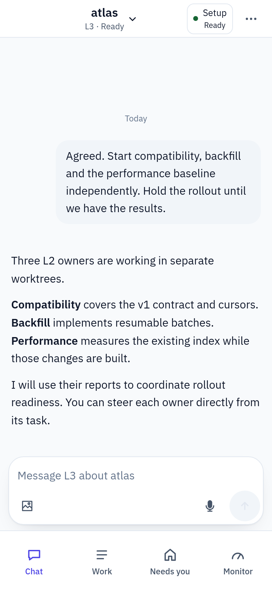
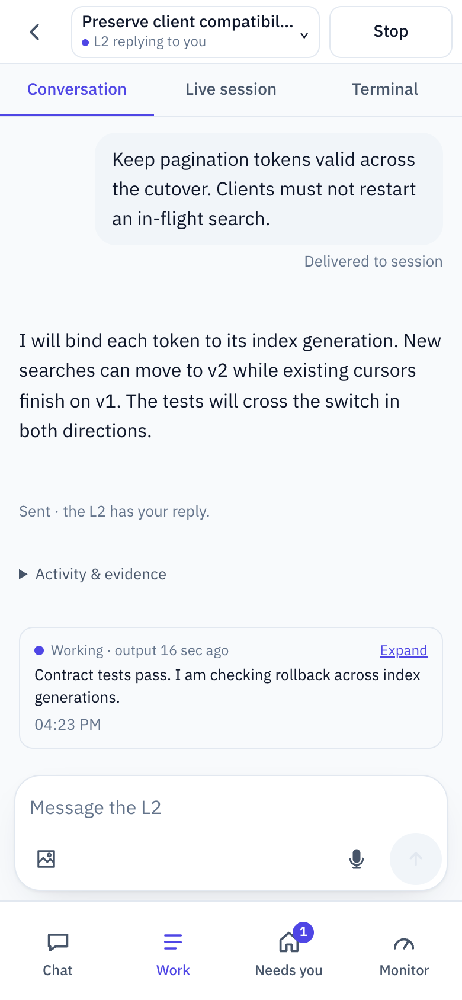
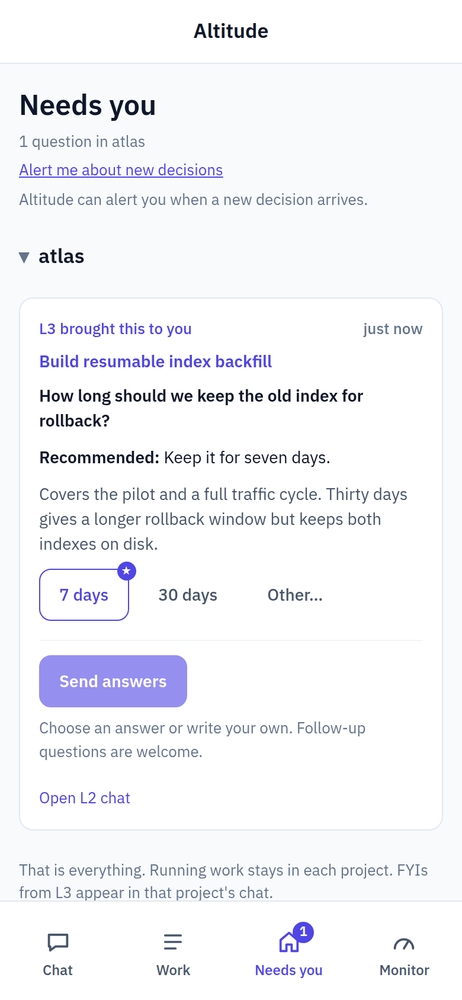

#  Altitude

**You lead. Altitude orchestrates. Agents ship.**

Be the principal engineer. Set the roadmap. Own the architecture. Make executive decisions.

Altitude is a self-hosted workspace where one developer leads Claude Code or Codex agents as an
engineering team. Your project orchestrator works through strategy with you and puts work in
motion. Task owners carry it through investigation, implementation, checks and pull requests: in
parallel, each in its own worktree, on your machine and your coding account.

**Steer from your phone, by voice.** Describe the next feature, settle a tradeoff or step into
any task. The work keeps going on your machine after you put the phone away.
[Set up phone access and voice](docs/OPERATIONS.md#on-iphone) with private HTTPS and a supported
browser.

**Early preview · Linux x86_64 · macOS on Apple silicon · [Get started](#get-started)**


## On your phone

<p>
  <a href="docs/images/project-phone.png"></a>
  <a href="docs/images/task-phone.png"></a>
  <a href="docs/images/decision-phone.png"></a>
</p>

[Watch the phone walkthrough](docs/images/phone-walkthrough.webm) ·
[Explore the desktop and phone walkthrough](docs/WALKTHROUGH.md)

## One conversation. An engineering team behind it.

<picture>
  <source media="(max-width: 600px)" srcset="docs/images/orchestration-phone.svg">
  
</picture>

**Delegate the follow-through.** L3 works through architecture and priorities with you, briefs
task owners, tracks delivery and answers questions from decisions you've already made. Unresolved
choices reach **Needs you**; independent work keeps moving.

**Give every task an owner.** Each L2 owns an isolated worktree and delivery through a PR. It can
enlist L1 helpers and remains accountable for their work. Your project's checks and review govern
delivery; request a merge hold when you want the final say before merging.

**Take the controls at any depth.** Talk directly to an owner, inspect its live session or redirect
the work. Move between project strategy and implementation detail from the same browser, on your
computer or [your phone](docs/OPERATIONS.md#on-iphone).

One engine is enough, and each integration is
[replaceable by design](docs/ARCHITECTURE.md#engine-integration-boundary).

## Built in

- **Phone access.** [Pair each browser](docs/SETUP.md#pair-each-device) with a one-time code, add
  Altitude to the iPhone Home Screen and get an alert when a decision needs you. Dictation runs on
  your computer on Linux and uses the browser's recognition elsewhere.
- **Terminals beside the work.** [Open a shell](docs/ARCHITECTURE.md#operator-terminal) in a task's
  worktree or the project folder from the browser. A command an agent hands you arrives typed at
  the prompt, waiting for your Enter.
- **Operator grants.** When a task needs to act on your machine beyond its sandbox, such as a
  service change or a release, you [approve one stated purpose](docs/CLI.md#operator-grant); each
  command runs as you and is recorded on the task.
- **Validation runs.** Owners check their changes in
  [disposable runs](docs/DEVELOPMENT.md#validation-runner) before merging: a Linux container, a
  confined run on a Mac or an iOS Simulator iPhone.

## Get started

Altitude runs for one person on a Linux x86_64 machine with a systemd user manager or a Mac with
Apple silicon on macOS 15 or newer. You need Python 3.12+, Git, OpenSSL (on a Mac, Homebrew's
`openssl@3`), an authenticated GitHub CLI and one authenticated coding CLI. Agent work uses your
coding account's allowance and normal charges. A [Linux container deployment](docs/CONTAINERS.md)
is under validation.

1. Install the latest release as the account that will use Altitude:

   ```sh
   curl --proto '=https' --tlsv1.2 -fsSL https://github.com/mburakyucel/altitude/releases/latest/download/install.sh | sh
   ```

   Releases are early previews: expect rough edges, and read the
   [release notes](CHANGELOG.md) for known limitations. The script checks the machine, runs
   nothing it downloads unless it matches the release's checksums and prints the next steps. The
   [installation steps](docs/SETUP.md#install-the-application) explain what it trusts and how to
   verify a release's script before running it.
2. Put `~/.local/bin` on your PATH and run `alt doctor`. The release includes the CLI, daemon and
   web app; installation enables a per-user service and saves its tool PATH.
3. Follow the [certificate trust guide for Linux, macOS and phones](docs/SETUP.md#trust-https-on-each-device).
   On the hosting computer, use the public CA file reported by `alt doctor`; on another device,
   use **Set up a device** or `alt tls-share` with your configured network address. Compare its
   fingerprint, trust it deliberately, then verify the exact HTTPS URL without a warning.
   [Pair the browser](docs/SETUP.md#pair-each-device) with the code `alt pair` prints and
   use [First run](docs/SETUP.md#first-run-in-the-browser) to add your project.

<details>
<summary>Ask your coding agent to help install</summary>

Paste into Claude Code or Codex on the machine that will run Altitude. This is assisted setup;
unattended installation is not yet validated.

```text
Help me install Altitude using https://github.com/mburakyucel/altitude/blob/main/docs/SETUP.md
and the instructions shipped with the selected version. Check prerequisites and my normal
engine/tool PATH first. Install only from the project's published GitHub release, as that guide
describes, and stop if a download or checksum check fails. Ask before privileged commands or changes
to existing configuration, services or shell profiles. Keep localhost HTTPS and security and
authority safeguards. Leave authentication and certificate trust to me in my own terminal or
browser; never read or copy credentials or private keys. Stop and explain refused or failed
checks. Run alt doctor and report anything unverified. Do not discover repositories, register
projects or start tasks; I will choose my project in the app.
```

</details>

## Documentation

| Start here | Go deeper |
| --- | --- |
| [Setup](docs/SETUP.md) | [Architecture](docs/ARCHITECTURE.md) · [Session lifecycle](docs/SESSION_LIFECYCLE.md) |
| [Walkthrough](docs/WALKTHROUGH.md) | [CLI reference](docs/CLI.md) · [Operations](docs/OPERATIONS.md) |
| [Contributing](CONTRIBUTING.md) | [Development and checks](docs/DEVELOPMENT.md) |
| [Roadmap](docs/ROADMAP.md) | [Release checkpoints](docs/RELEASING.md) · [Changelog](CHANGELOG.md) |

## Feedback

[Open an issue](https://github.com/mburakyucel/altitude/issues/new/choose) with a bug, idea or
confusing part of setup. Keep examples fictional or redacted. Report vulnerabilities privately
using the [security policy](SECURITY.md).

Altitude is source-available under the [Functional Source License](LICENSE).
