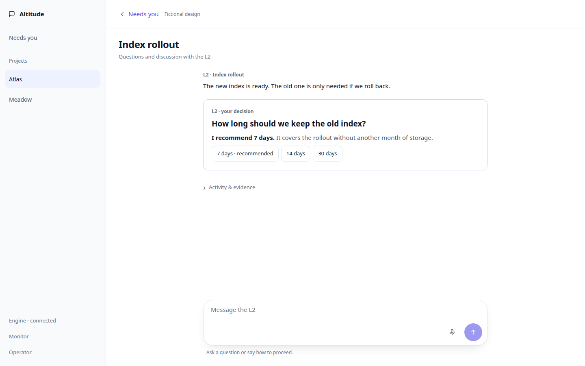
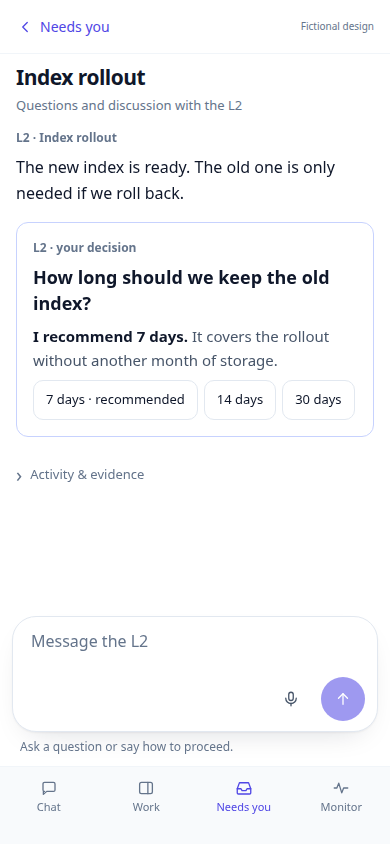
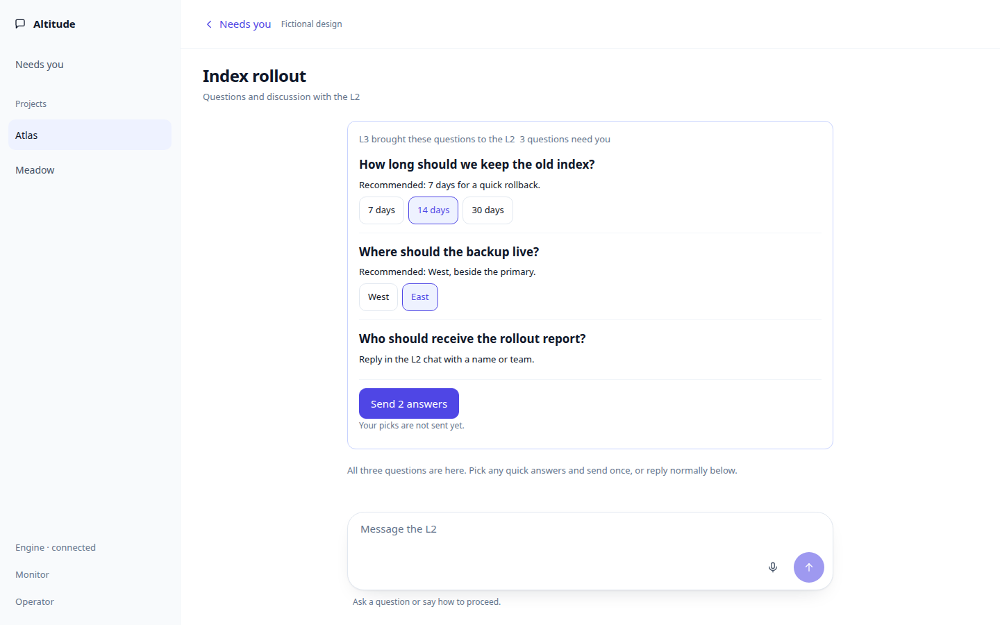
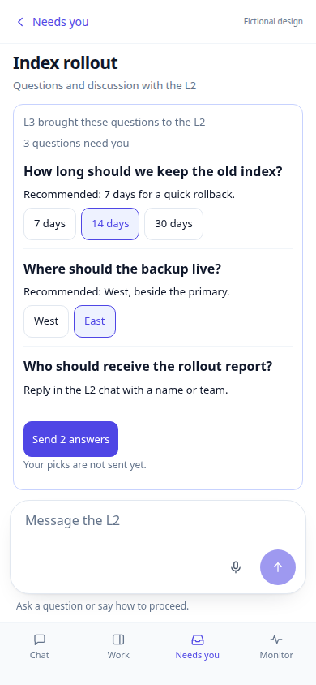
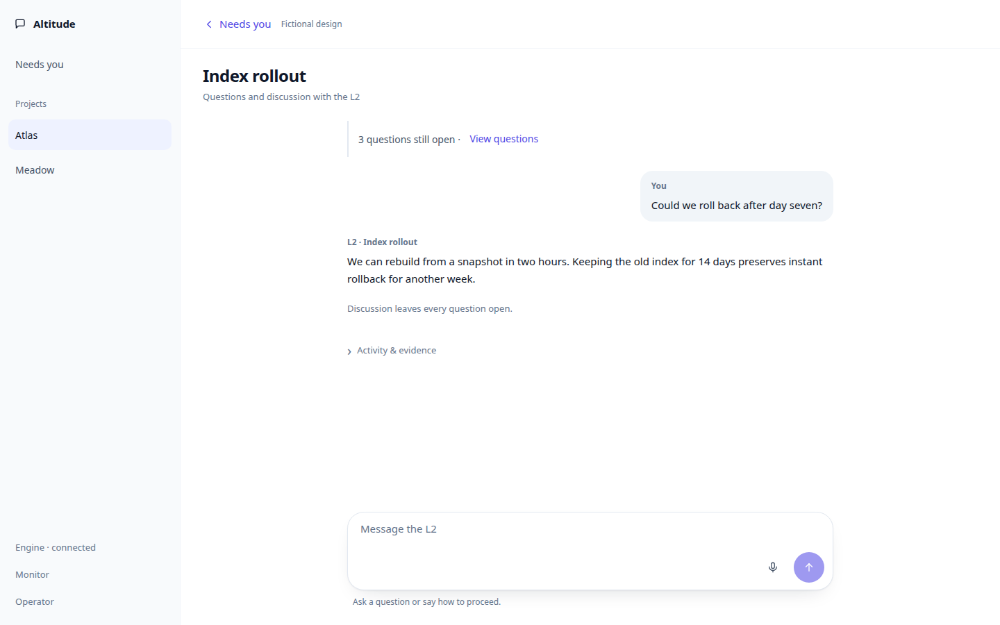
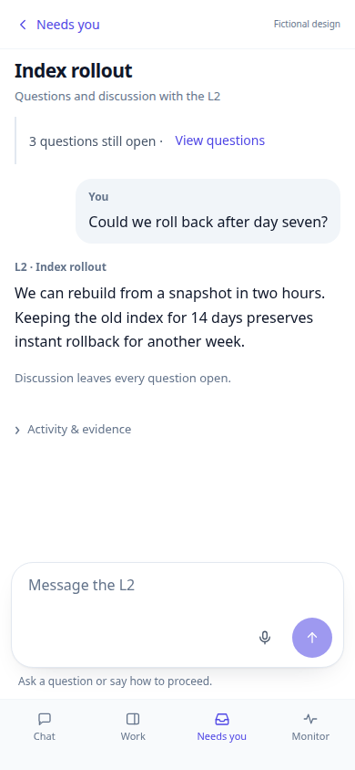
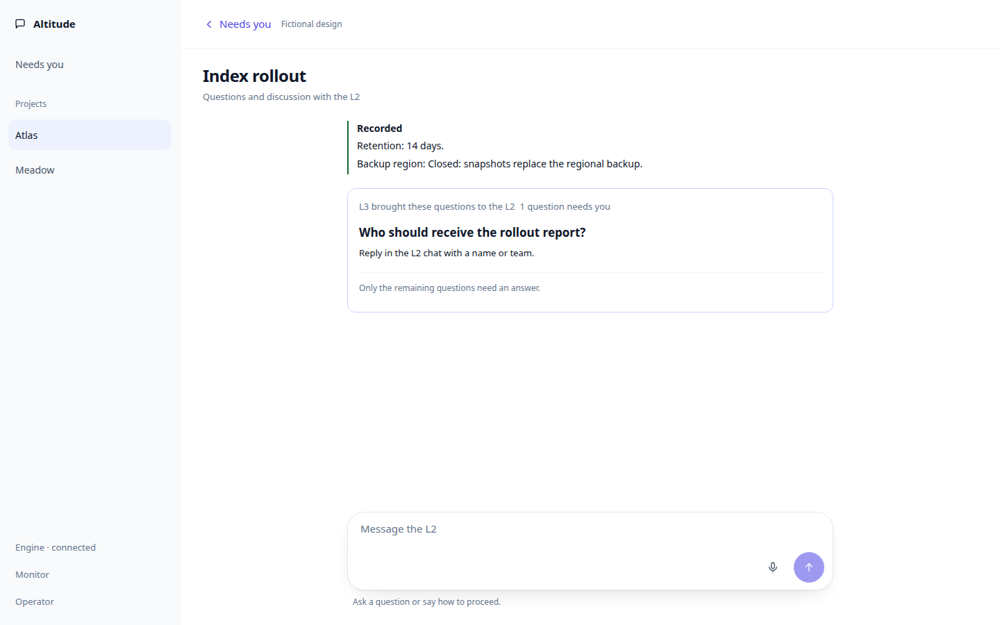
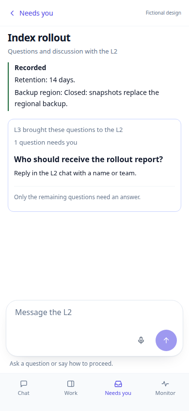
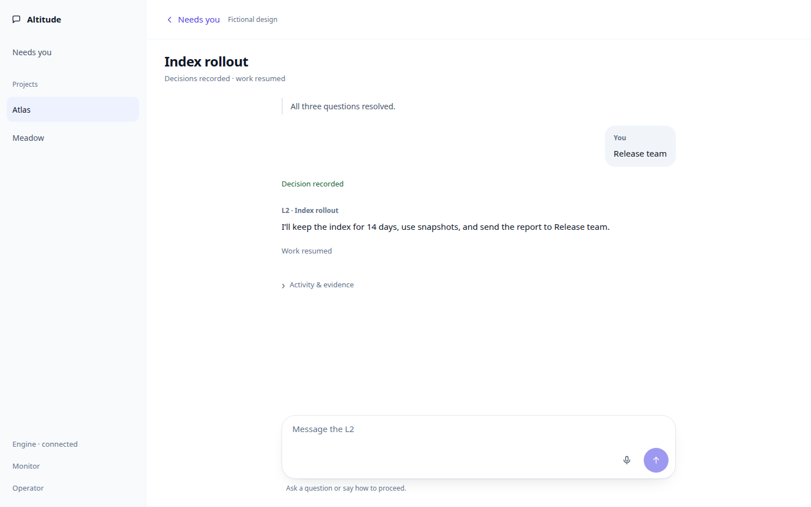
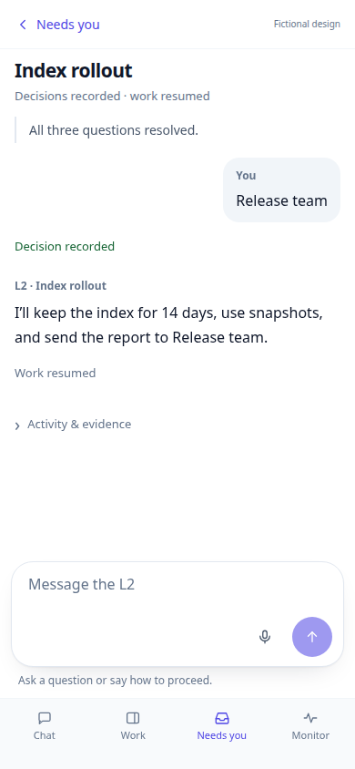

# Conversation-first decisions

Six fictional examples at 1440×900 and 390×844. Independent questions, optional quick choices, and ordinary conversation share one L2 thread. Nothing is preselected.

[Interactive review](index.html) · [Design and behavior](../CONVERSATION_FIRST.md)

## Questions upfront in Needs you

[Desktop](captures/desktop-needs-you.png) · [Phone](captures/phone-needs-you.png)

## One question with immediate quick choices

[Desktop](captures/desktop-single.png) · [Phone](captures/phone-single.png)

## Grouped answers: pick then send once

[Desktop](captures/desktop-group.png) · [Phone](captures/phone-group.png)

## A follow-up leaves the questions open

[Desktop](captures/desktop-followup.png) · [Phone](captures/phone-followup.png)

## Answered and irrelevant questions close

[Desktop](captures/desktop-partial.png) · [Phone](captures/phone-partial.png)

## All questions answered and work resumed

[Desktop](captures/desktop-accepted.png) · [Phone](captures/phone-accepted.png)

Shared loading, error, denied, and voice controls are in the interactive appendix. They use normal CI artifacts, without a duplicated committed capture gallery.
