# Conversation-first decisions: captured review

Pending design approval. Fictional content only. These captures are generated by the deterministic
Playwright wireframe walkthrough at 1440×900 and 390×844. They demonstrate a proposal, not live
application behavior.

[Design and architecture](../CONVERSATION_FIRST.md) · [Interactive review](index.html)

## Needs you: quick acceptance or conversation

[Desktop](captures/desktop-needs-you.png) · [Phone](captures/phone-needs-you.png)

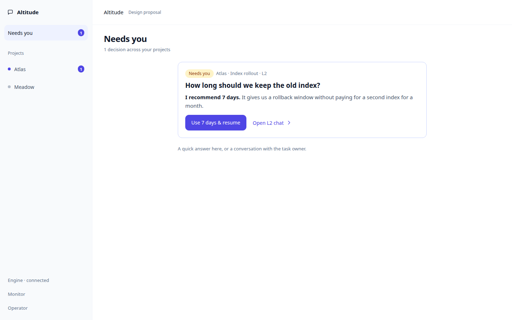

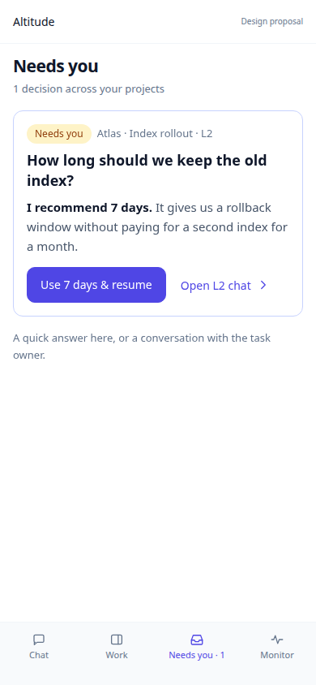

## Open the L2 question with surrounding discussion

[Desktop](captures/desktop-question.png) · [Phone](captures/phone-question.png)

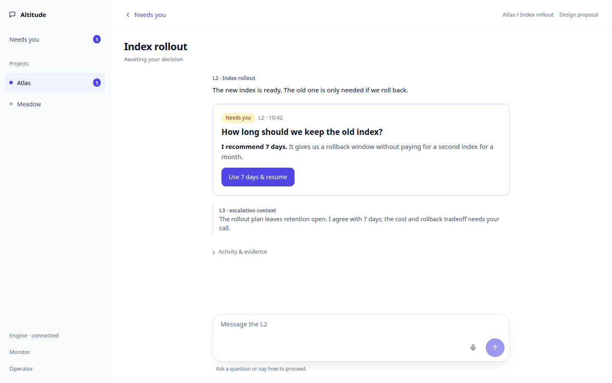

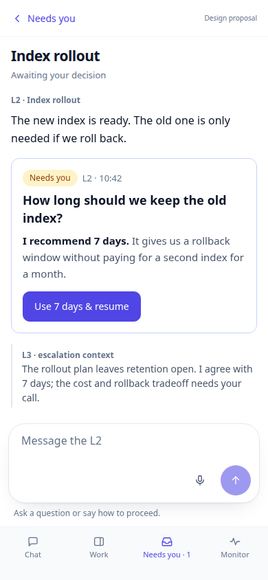

## Follow-up: the L2 answers and the question stays open

[Desktop](captures/desktop-followup-answer.png) · [Phone](captures/phone-followup-answer.png)

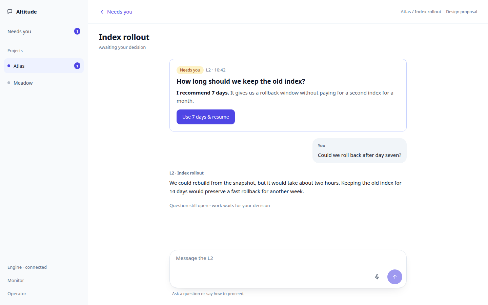

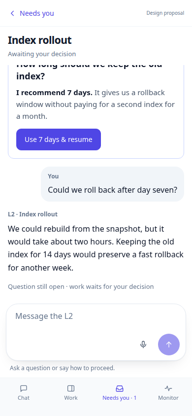

## Typed alternative, with the phone keyboard

[Desktop](captures/desktop-alternative-draft.png) · [Phone](captures/phone-alternative-draft.png)

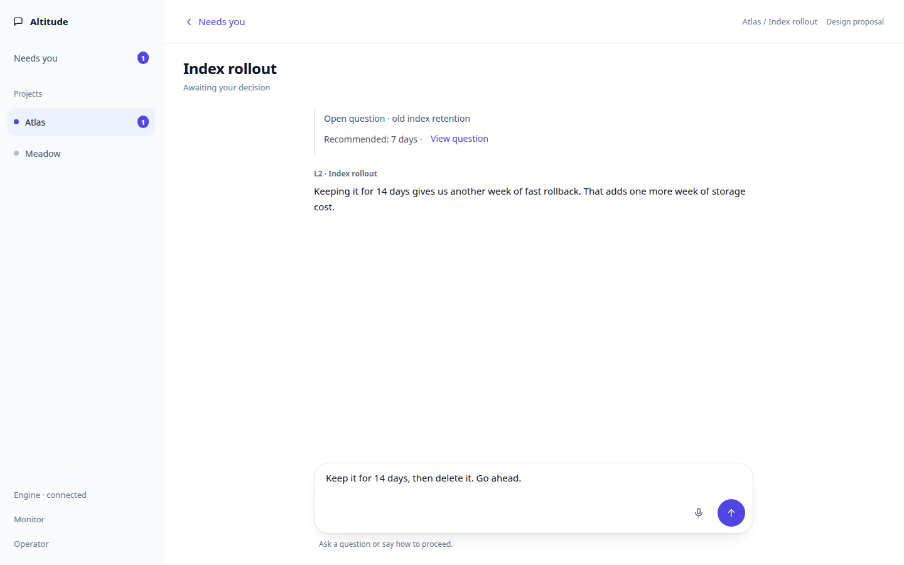

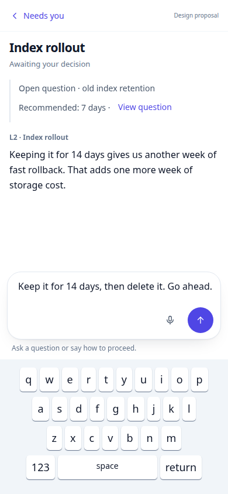

## A typed decision is recorded without another confirmation

[Desktop](captures/desktop-typed-decision.png) · [Phone](captures/phone-typed-decision.png)

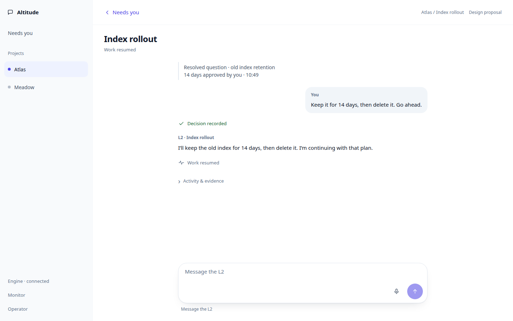

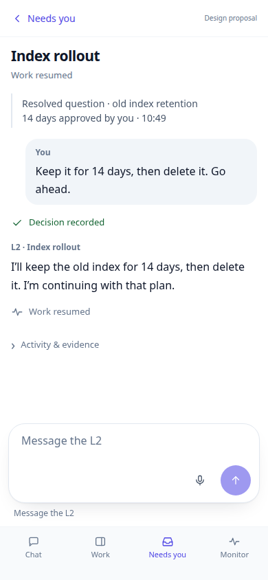

## A simple answer is enough; no special approval phrase

[Desktop](captures/desktop-simple-answer.png) · [Phone](captures/phone-simple-answer.png)

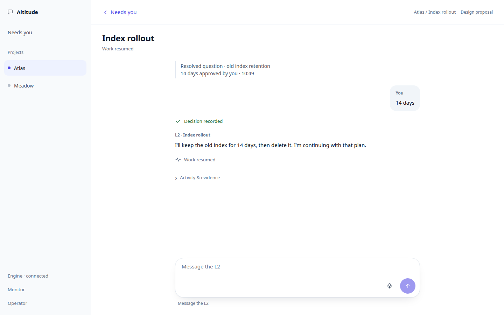

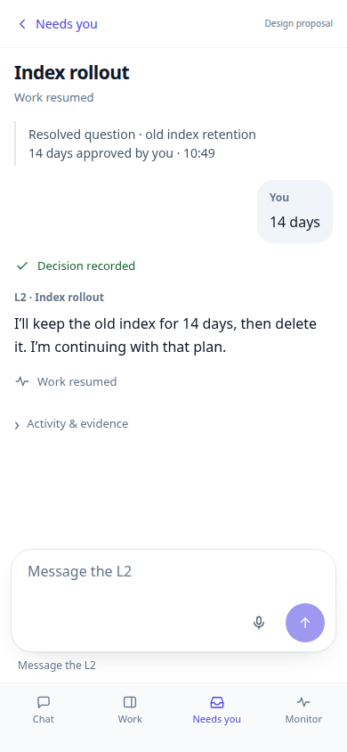

## Quick acceptance recorded, work resumed

[Desktop](captures/desktop-resumed.png) · [Phone](captures/phone-resumed.png)

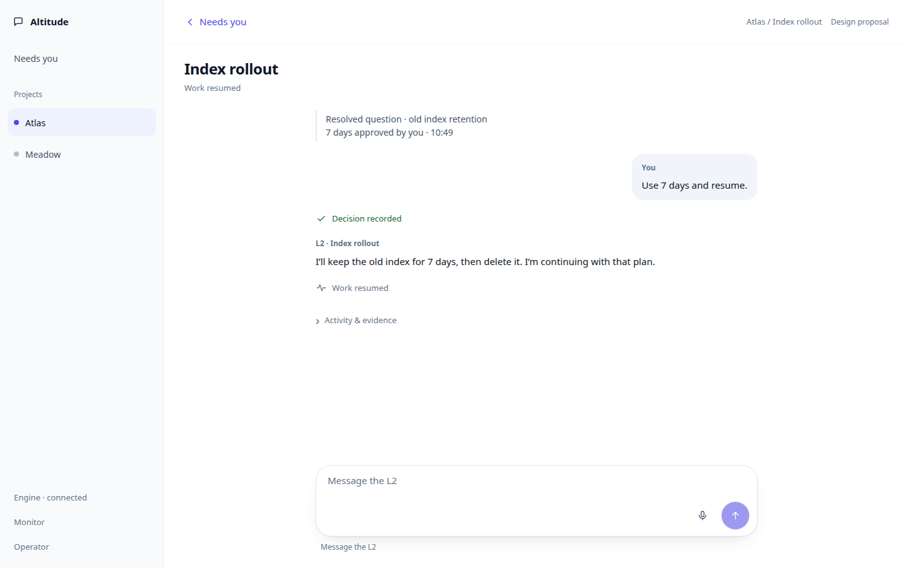

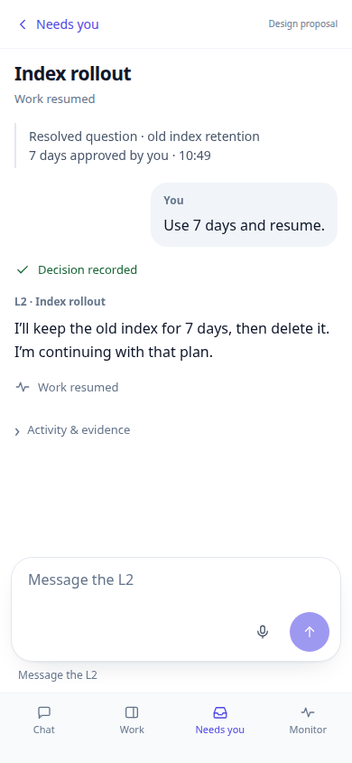

## Needs you after acceptance

[Desktop](captures/desktop-quick-acceptance.png) · [Phone](captures/phone-quick-acceptance.png)

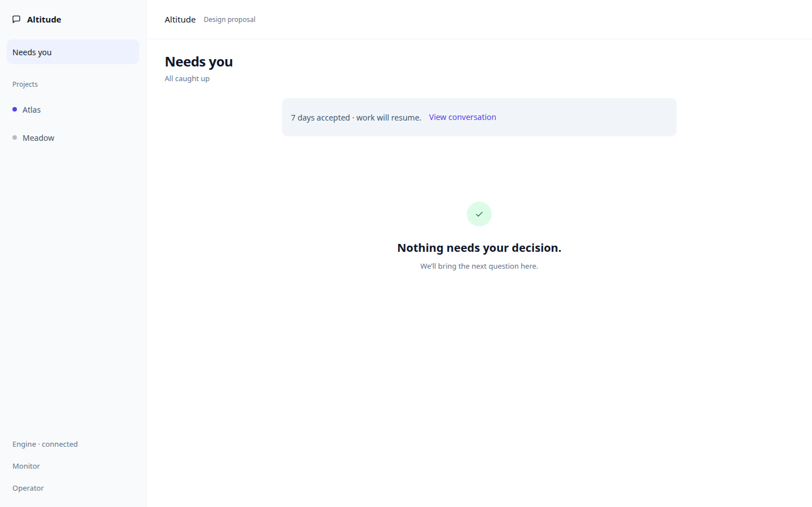

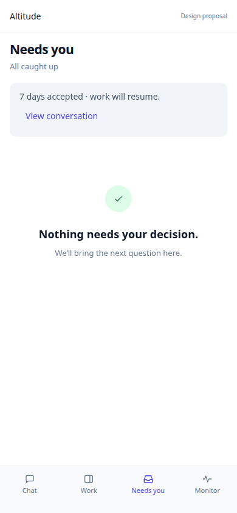

## A stale item resolved in another conversation

[Desktop](captures/desktop-resolved-elsewhere.png) · [Phone](captures/phone-resolved-elsewhere.png)

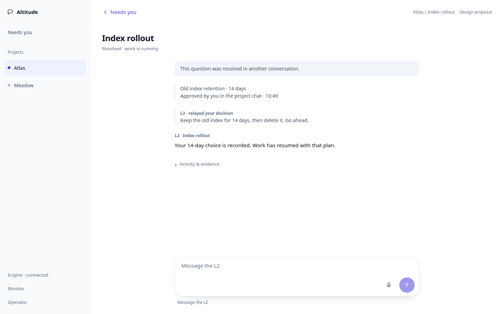

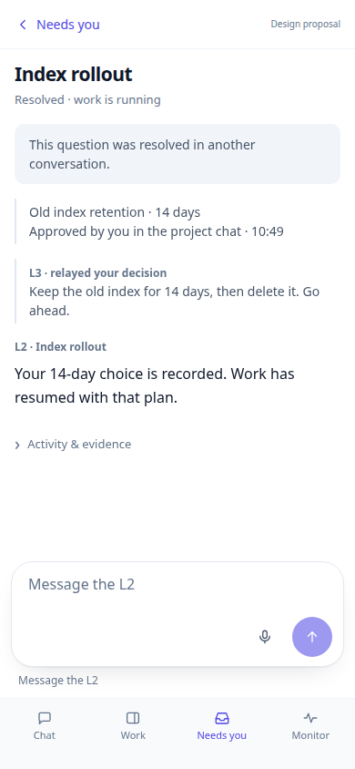

## State captures

| State | View |
| --- | --- |
| Loading Needs you | [Desktop](captures/desktop-state-list-loading.png) · [Phone](captures/phone-state-list-loading.png) |
| Needs you read failed | [Desktop](captures/desktop-state-list-error.png) · [Phone](captures/phone-state-list-error.png) |
| Cached Needs you, offline | [Desktop](captures/desktop-state-list-offline.png) · [Phone](captures/phone-state-list-offline.png) |
| Needs you during discussion | [Desktop](captures/desktop-state-discussion.png) · [Phone](captures/phone-state-discussion.png) |
| Loading the question | [Desktop](captures/desktop-state-loading.png) · [Phone](captures/phone-state-loading.png) |
| Read failed, retry | [Desktop](captures/desktop-state-read-error.png) · [Phone](captures/phone-state-read-error.png) |
| Offline with cached discussion | [Desktop](captures/desktop-state-cached-error.png) · [Phone](captures/phone-state-cached-error.png) |
| Recording quick acceptance | [Desktop](captures/desktop-state-accepting.png) · [Phone](captures/phone-state-accepting.png) |
| Acceptance failed | [Desktop](captures/desktop-state-accept-error.png) · [Phone](captures/phone-state-accept-error.png) |
| Acceptance denied | [Desktop](captures/desktop-state-denied.png) · [Phone](captures/phone-state-denied.png) |
| Sending a message | [Desktop](captures/desktop-state-sending.png) · [Phone](captures/phone-state-sending.png) |
| Message failed, draft retained | [Desktop](captures/desktop-state-send-error.png) · [Phone](captures/phone-state-send-error.png) |
| Message queued, L2 unavailable | [Desktop](captures/desktop-state-waiting.png) · [Phone](captures/phone-state-waiting.png) |
| L2 could not answer | [Desktop](captures/desktop-state-reply-error.png) · [Phone](captures/phone-state-reply-error.png) |
| Decision recorded, waiting to resume | [Desktop](captures/desktop-state-accepted-waiting.png) · [Phone](captures/phone-state-accepted-waiting.png) |
| Question without a recommendation | [Desktop](captures/desktop-state-no-recommendation.png) · [Phone](captures/phone-state-no-recommendation.png) |
| A simple typed answer | [Desktop](captures/desktop-state-simple-input.png) · [Phone](captures/phone-state-simple-input.png) |
| A reply arrives below the question | [Desktop](captures/desktop-state-new-reply.png) · [Phone](captures/phone-state-new-reply.png) |
| A newer question replaced this one | [Desktop](captures/desktop-state-revised.png) · [Phone](captures/phone-state-revised.png) |
| Question unavailable | [Desktop](captures/desktop-state-missing.png) · [Phone](captures/phone-state-missing.png) |
| Task archived, read only | [Desktop](captures/desktop-state-archived.png) · [Phone](captures/phone-state-archived.png) |
| Listening | [Desktop](captures/desktop-state-listening.png) · [Phone](captures/phone-state-listening.png) |
| Transcribing | [Desktop](captures/desktop-state-transcribing.png) · [Phone](captures/phone-state-transcribing.png) |
| Dictation in editable draft | [Desktop](captures/desktop-state-dictated.png) · [Phone](captures/phone-state-dictated.png) |
| Microphone denied | [Desktop](captures/desktop-state-mic-denied.png) · [Phone](captures/phone-state-mic-denied.png) |
| Transcription failed | [Desktop](captures/desktop-state-voice-error.png) · [Phone](captures/phone-state-voice-error.png) |
| Voice unavailable | [Desktop](captures/desktop-state-voice-unavailable.png) · [Phone](captures/phone-state-voice-unavailable.png) |
