# Conversation-first decisions: implementation review

Six examples from the running application, with fictional tasks and deterministic L2 replies.
The application, API, storage, question resolution and session-resume path are real. No live-provider
test calls are involved. PR #264 is held for the operator's review and merge.

The [approved design](../../CONVERSATION_FIRST.md) describes the behavior. The remaining loading,
empty, failed, denied, stale, voice and navigation cases are covered in the normal Playwright artifacts,
primarily `web/e2e/conversation-decisions.pw.ts`, `task-page.pw.ts` and `task-lifecycle.pw.ts`.

## Needs you: accept or open the L2 conversation

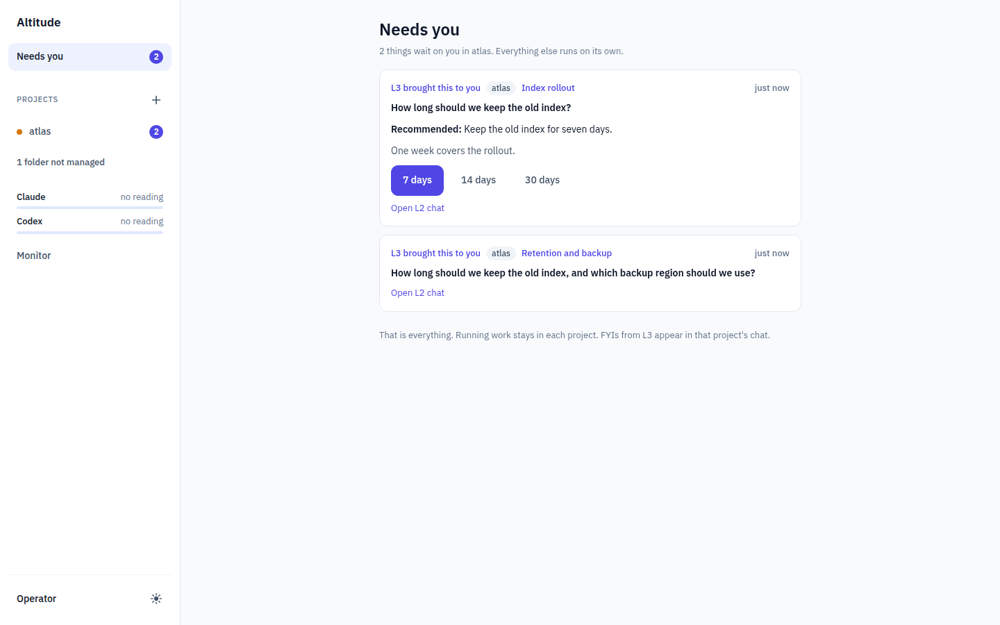
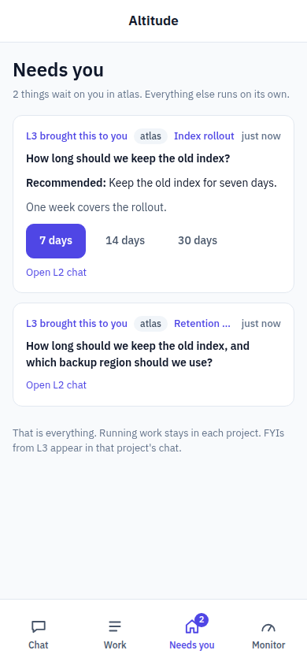

## One question: choose an explicit answer immediately

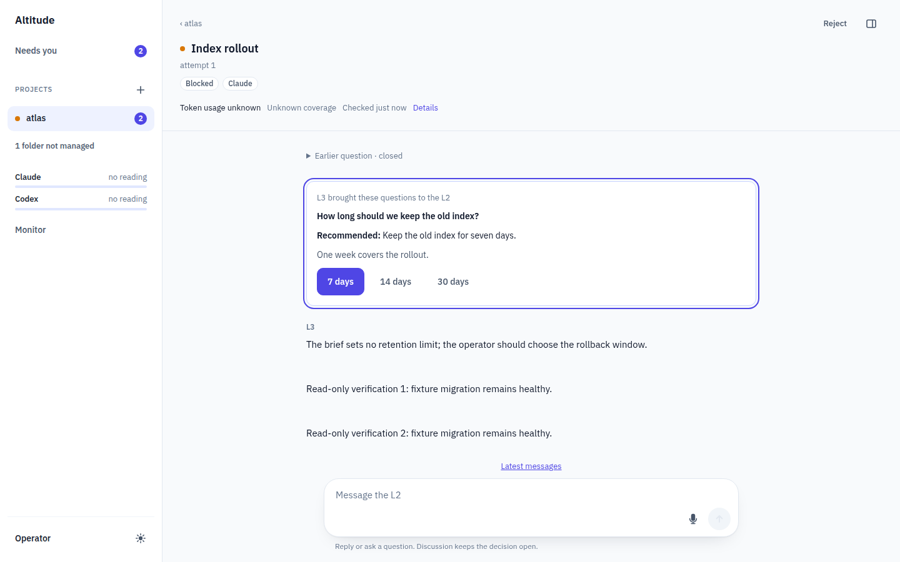
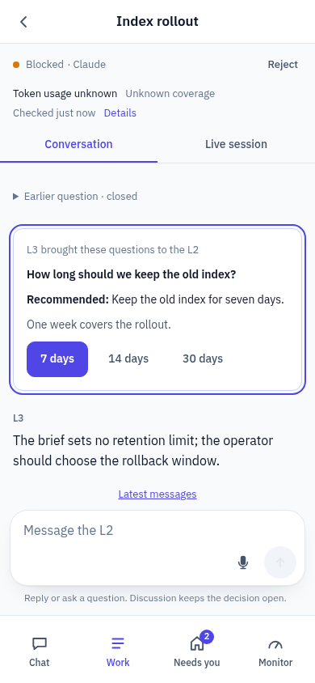

## Three questions: pick answers together, then send once

Nothing is preselected. Picking an alternative replaces the group recommendation action with
`Send N answers`; only those picks are submitted.
Longer groups scroll inside the phone conversation; the initial view starts at their first question.

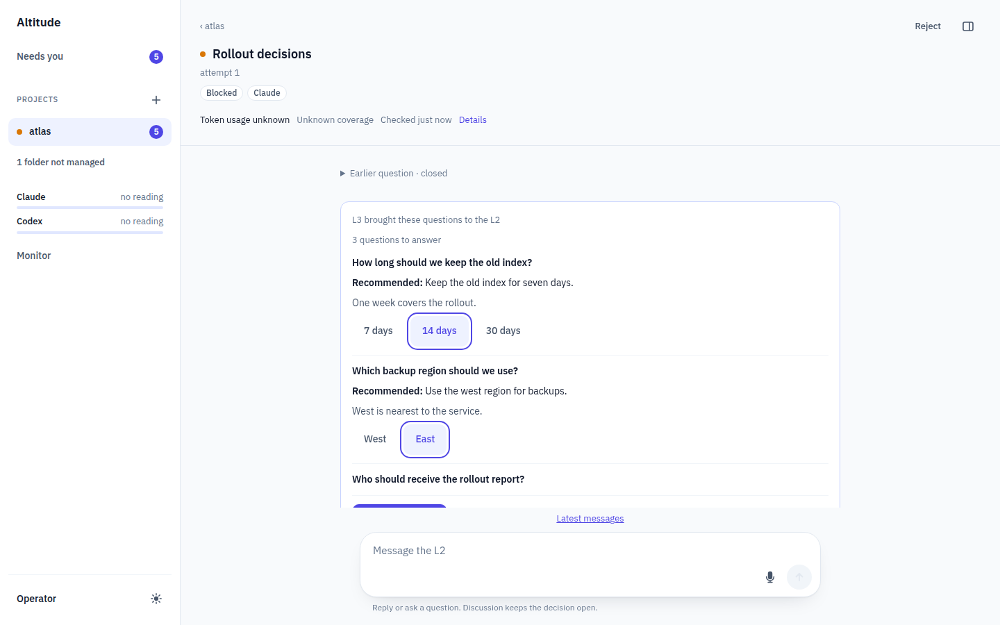
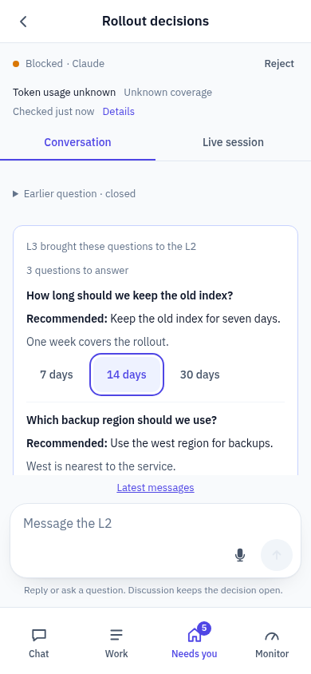

## Follow up: the recommendation remains unaccepted

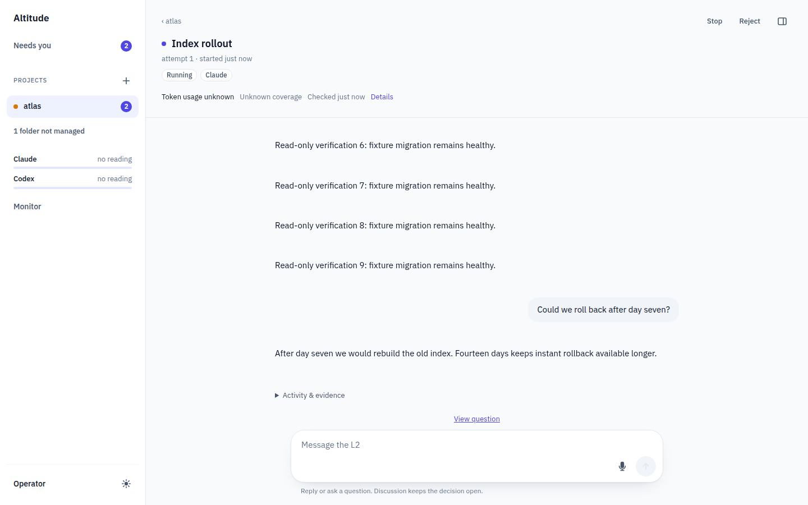
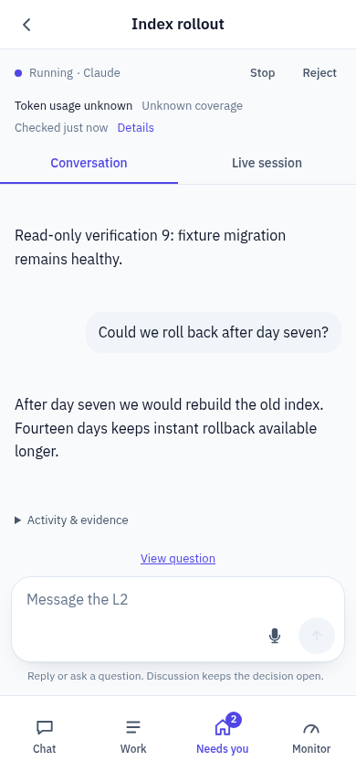

## Partial answers: keep the choice already made and ask only what remains

Fourteen days was chosen explicitly, then the remaining region recommendation was accepted.
The plain report-owner question remains open. Needs you shows only that remaining question;
chat retains the receipts for the earlier answers.

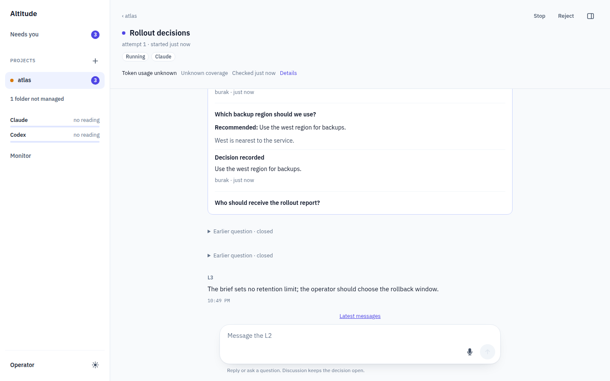
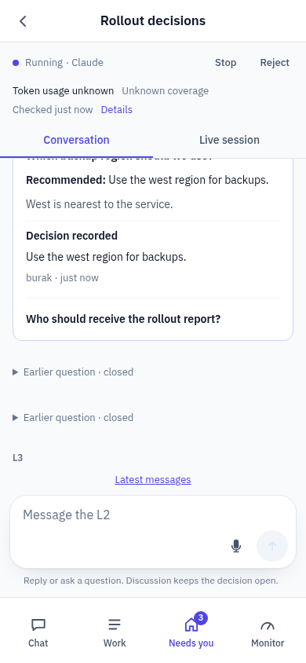

## Answer the remaining question in chat and continue

The typed report-owner answer closes after the L2 records its meaning against the original message.
The same walkthrough also checks typed answers covering several questions and closing a question
made irrelevant by a changed direction.

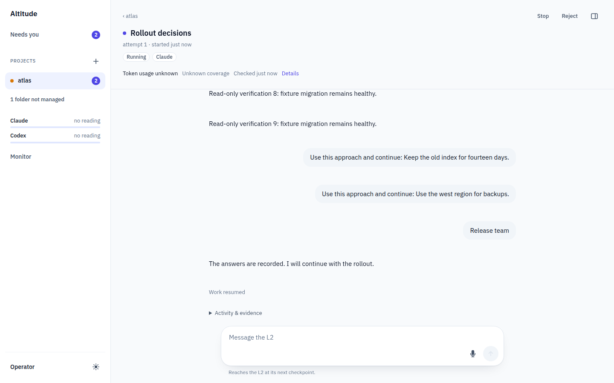
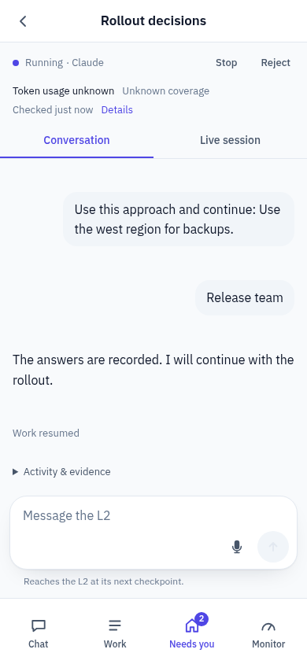

Reproduce with `make check`, then `python3 design/wireframes/capture_conversation_first.py --implementation`.
