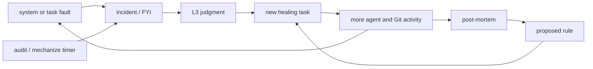
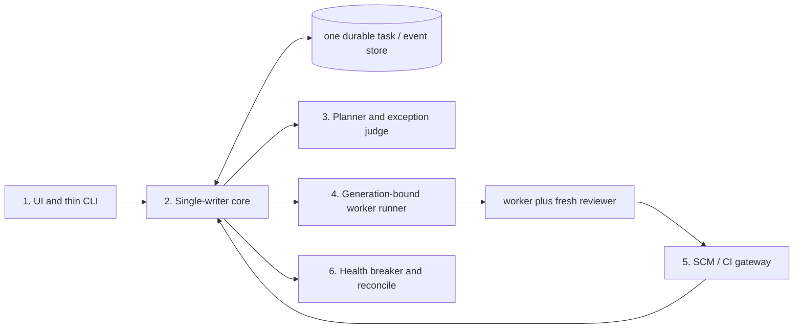

# Altitude architecture reset

*Current as-built map and reduction target, 2026-08-31. This document replaces the aspirational v1
description that had drifted away from the code. It is descriptive, not an instruction to restart
the service or resume archived tasks.*

## Executive summary

Altitude grew a large control plane around early agent and Git collisions. Each failure encouraged
another incident, rule, recovery task, hook, or agent session. That produced positive feedback:
recovery work could itself fail and create more recovery work.

At the stabilization boundary the runtime had 78 live task records—26 blocked, 32 parked, and 20
rejected—with no healthy active task. It also had 19 pending rules, roughly 79 incident records, and
126 registered worktrees. The service is deliberately stopped and masked while that state is
archived and removed from live scheduling.

The next architecture should be smaller than the current one. Six components, three agent roles,
one writer, one task state machine, and one bounded worker pipeline are enough.

## Current system, as built

The user-facing product is comparatively straightforward: a React SPA with Inbox, Projects,
Project, Task, Chat, and Monitor routes over a Python HTTP API. Most complexity is in the control
plane behind it.

| Area | Current shape | Consequence |
|---|---|---|
| State | File records plus several ledgers and marker fields | Nine formal states and many implicit secondary state machines |
| Writers | HTTP handlers, timer threads, and CLI processes call state code | The documented “one writer” invariant is not true |
| Planning | Proposal, critic, L3, L2, nested L1, and reviewer roles | Small changes can pay for the full orchestration chain |
| Workers | Background sessions, detached wrappers, nested worktrees | Ownership, resume, cleanup, and collision handling are difficult |
| Policy | Hooks parse shell text, environment, and ledgers | Capabilities are indirect and costly to reason about |
| Healing | Faults, post-mortems, rules, audits, and mechanization create work | Recovery can amplify the condition it is trying to repair |
| Landing | Local landing logic plus generic checks and a separate remote gate | The new gate is large, currently fails before candidate execution, and is not the authoritative landing path |
| Runtime | One service plus descendants with incomplete generation ownership | A restart is not yet a reliable whole-generation cleanup boundary |

### The unhealthy feedback loop

There is no global breaker that prevents recovery work from generating more recovery work.
Deduplication can reduce identical records, but it does not remove the positive-feedback design.

### Scale snapshot

- About 16,500 lines of executable, frontend, and workflow code.
- About 9,750 lines of tests across 517 test methods.
- About 35,500 words of documentation plus 4,200 words of personas.
- Seven personas, five schemas, 47 CLI parser entries, and 56 recorded decisions.
- The trusted-gate change alone added about 3,500 lines, including C, shell, Python, and workflow code.
- Roughly 2,000 lines implement policy indirectly through shell parsing, Git policy, and launch/edit hooks.

Large tests and documentation are not inherently bad. Here they are warning signs because several binding
documents describe behavior that does not exist, while implemented behavior is spread across marker fields,
hooks, and process conventions.

### Important corrections to the old architecture document

- The CLI does not talk only to a single local writer; it imports state operations directly.
- The lifecycle has nine declared states, not five, plus additional marker-driven transitions.
- There is no general Git/GitHub/worker reconciliation job matching the old design.
- The deterministic Small lane and runtime Settings surface described as implemented are absent on main.
- The React router has no Listen route, although older docs and server plumbing still mention it.
- The trusted remote gate is frozen evidence, not a working landing authority.

## Smallest useful target

The health breaker is part of the core control loop. It observes and reconciles state; it is not
another task queue.

### Work lanes

| Lane | Pipeline | Hard boundary |
|---|---|---|
| Small | direct worker → fresh review → CI → land | At most one fix and re-review; no proposal, critic, L3 task orchestration, or nested L1 |
| Medium | one short coordinator brief → Small pipeline | Add judgment, not another execution hierarchy |
| Large | proposal → human decision → split into Medium tasks | No execution until the split and decision are explicit |
| Healing | stop dispatch → deterministic reconcile → one bounded repair → two health probes | Healing cannot create another healing task |

“L1” should collapse into the write-capable worker. Independent review remains a separate, fresh,
read-only role. The resulting agent vocabulary is coordinator, worker, and reviewer.

## Collision-preventing invariants

1. Every mutation crosses one supervisor transaction boundary. UI, CLI, timers, and agents do not
   write task files independently.
2. One task has one branch, one worktree, and one active generation. Reassignment requires the old
   generation to be durably empty.
3. Every command carries task id, generation, and expected state. Stale commands fail a
   compare-and-swap check.
4. Landing evidence binds the exact base and head. Publication uses an exact-base lease, never an
   unrelated green check or unchecked fallback.
5. Unknown ownership or a system fault closes normal dispatch. Recovery permits one executor and
   cannot create or dispatch recovery tasks recursively.
6. The Small lane is structurally bounded: worker → reviewer → one fix → reviewer/land. Promotion is
   explicit and preserves the same history.

## What to preserve, collapse, and freeze

Preserve:

- The React product surface and the first three wireframe drafts.
- Clear task transition semantics, one-worktree-per-task intent, exact identity/lease concepts, and
  independent review.
- Existing remote-gate work as evidence until a simpler replacement is proven.

Collapse:

- L1 and L2 into one direct worker plus a fresh reviewer.
- Seven personas into coordinator, worker, and reviewer.
- CLI and HTTP mutation paths into the single-writer core.
- Status, inbox, fault, incident, rule, and launch ledgers into one task/event store with generated
  human views.
- Shell-inferred permissions into structural runner operations.

Freeze until explicitly re-approved:

- Automatic rule or skill application.
- Weekly audits and incident mechanization.
- Autonomous backlog draining and self-deploy/restart behavior.
- Dynamic quota optimization and statusline mutation.
- Remaining Listen/TTS product work.
- Any attempt to “fix” the current gate by adding another containment layer before its threat model
  and keep/simplify/revert decision are reviewed.

After migration, delete nested worker wrappers, obsolete compatibility markers, unused Listen
plumbing, local unchecked landing fallbacks, and hook-based policy code that the structural runner
replaces. Git history and the stabilization archive preserve the old work.

## Consolidated follow-up

Future work is intentionally limited to these issues:

- #106 — single-writer core, one task/event store, and documentation reset.
- #107 — direct Small lane and generation-owned workers.
- #108 — global recovery breaker and deterministic reconciliation.
- #109 — simpler trusted CI and exact-base landing.
- #105 — bounded process-owned capabilities.
- #104 — deferred wireframe review and optional completion.

The archived tasks, rules, incidents, sessions, and worktrees are evidence for those issues. They
must not be replayed into the scheduler as individual work items.

## Restart boundary

This documentation change does not restart Altitude. Keep the service stopped while the live task,
session, rule, and worktree state is archived and removed from scheduling. Restart should be an
explicit decision after reviewing this map and choosing the minimum implementation sequence; it
must not happen merely because the old queue has been cleared.
