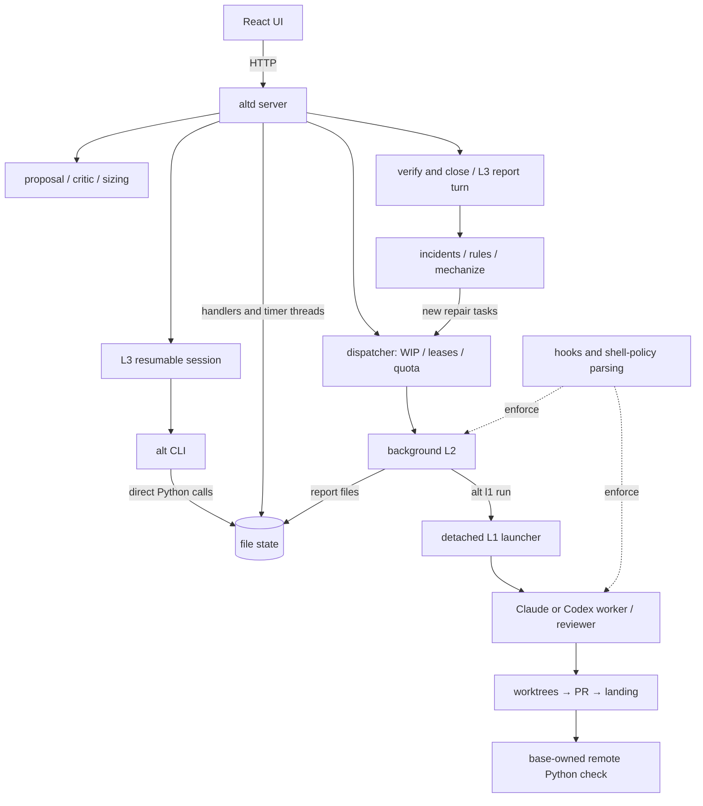
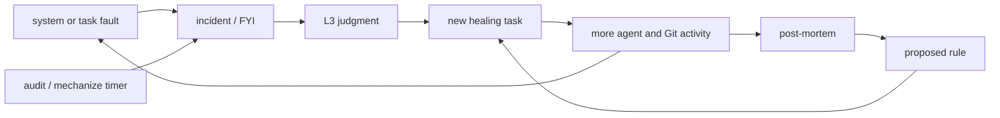
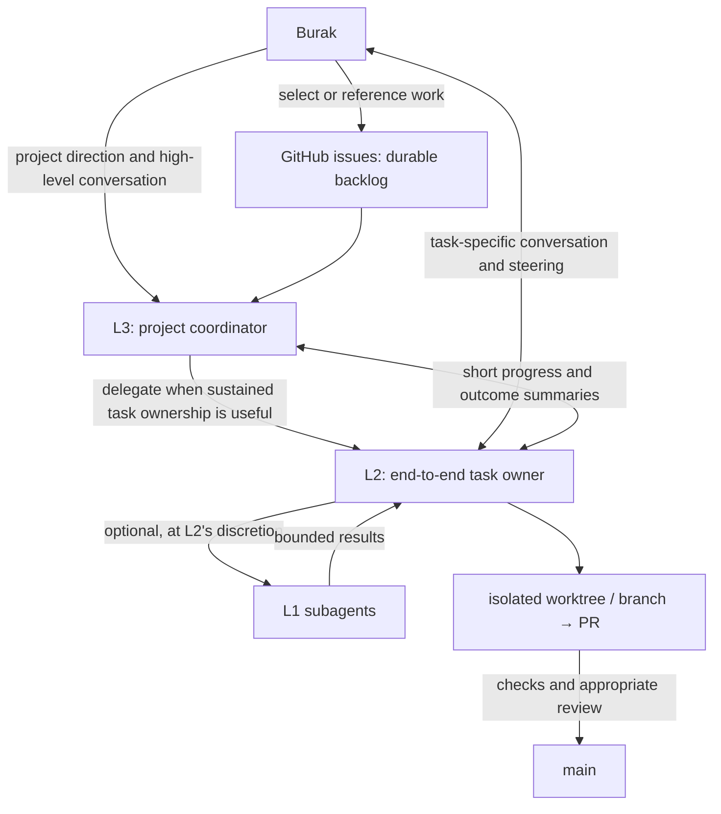
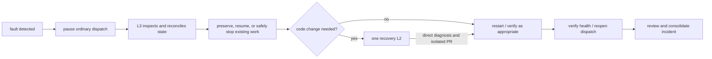

# Altitude architecture: current system and agreed direction

*Updated 2026-08-31 after the stabilization review and the human/agent architecture discussion.
This document records the current system honestly and the agreed operating model. It deliberately
does not prescribe a request classifier, rigid workflow schema, storage technology, or module
layout.*

## Purpose

Altitude gives Burak one high-level point of contact for a project while preserving direct access
to the agent that owns each task. It should make agent work easier to direct, isolate, review,
recover, and finish. It should not turn flexible conversation into a large mandatory orchestration
pipeline.

The governing design principle is:

> Use model judgment to decide what work is needed. Use code to enforce ownership, isolation,
> durability, reviewable integration, and safe recovery.

The runtime is deliberately stopped and masked while the old live queue and session state are
archived. Nothing in this document authorizes a restart or replay of archived tasks.

## Current system, as built

The user-facing product is comparatively simple: a React SPA with Inbox, Projects, Project, Task,
Chat, and Monitor routes over a Python HTTP API. Most complexity accumulated behind it:

- HTTP handlers, timer threads, and CLI processes can all reach state-writing code.
- The lifecycle has nine declared states plus many secondary marker fields.
- Small work can enter proposal, critic, L3, L2, nested L1, review, and report stages.
- Process, session, worktree, task, and report ownership are not bound to one durable generation.
- Policy is partly inferred by parsing shell commands, environment, and several ledgers.
- Landing is split between local policy and a small base-owned GitHub Actions check.
- Recovery uses the same task-producing machinery it is trying to repair.

### The unhealthy feedback loop

At the stabilization boundary there were 78 live task records—26 blocked, 32 parked, and 20
rejected—with no healthy active task. There were also 19 pending rules, roughly 79 incident
records, and 126 registered worktrees. Deduplication can reduce identical records, but it does not
remove this positive-feedback design.

### Scale snapshot

- About 13,100 lines of executable, frontend, and workflow code.
- About 9,800 lines of tests across 508 test methods.
- About 35,500 words of documentation plus 4,200 words of personas.
- Seven personas, five schemas, 47 CLI parser entries, and 56 recorded decisions.
- Roughly 2,000 lines implement policy indirectly through shell parsing, Git policy, and
  launch/edit hooks.

These numbers are context, not deletion targets. Existing components must be evaluated against the
agreed operating model before deciding what to retain, collapse, rewrite, or remove.

## Agreed operating model

### L3: high-level point of contact

L3 owns project-level conversation and coordination:

- discuss roadmap, divisions of work, priorities, and high-level implementation choices with Burak;
- maintain an overview of active tasks and what each L2 is building;
- interpret flexible requests and decide whether to answer directly, ask a question, or delegate;
- start and supervise L2s without becoming a relay for task-specific conversation;
- receive concise progress, decision, and completion summaries from L2s;
- own operational recovery when the platform itself is unhealthy.

L3 is not required to mine or drain GitHub issues autonomously. Burak can point L3 to an issue or
describe new work directly. L3 uses the conversation and project context rather than a keyword
classifier or rigid request schema.

### L2: directly reachable, end-to-end owner

One L2 owns a task from its beginning to its defined outcome. Depending on the request, that outcome
may be an architectural proposal, a landed implementation, or a system repair.

L2:

- talks directly with Burak about task-specific questions, decisions, and steering;
- loads only the relevant repository and project context;
- implements simple work directly;
- may use zero, one, or several L1 subagents when parallelism or an independent perspective is
  genuinely useful;
- integrates all L1 results into the task's branch and remains accountable for them;
- owns appropriate tests, review, PR handling, merge, and verification for code tasks;
- writes a concise human-readable outcome for L3 and the durable audit record.

The system does not precompute a mandatory number of implementers, reviewers, proposal passes, or
critique rounds. L2 chooses the working method within the hard boundaries below.

### L1: optional leverage

L1 is a subagent used at L2's discretion. It is not a mandatory stage and does not own the overall
task. Useful reasons to create an L1 include independent parallel work, focused research, a bounded
implementation slice, or fresh review. L2 remains responsible for scope, integration, collisions,
and completion.

## Flexible requests, not workflow classes

The following are examples of model judgment, not enumerated task types:

- A simple high-level question may be answered by L3 in the project conversation.
- A substantial architecture request may cause L3 to start an L2 so Burak can develop the proposal
  directly with the task owner.
- “Implement issue #123” may be enough for L3 to start an implementation L2 immediately.
- “Let’s discuss this” should not create a task or issue merely because work-related language
  appeared.
- A design conversation may transition into implementation when Burak explicitly asks to build it,
  or stop after preserving a proposal for later.

For proposal or architecture work, an L2 begins with a light context load: the request, current
architecture overview, relevant code/docs, and directly related issues or PRs. If that is enough,
it proposes. Otherwise it asks Burak focused questions directly. It does not load the entire task,
incident, rule, persona, or chat history by default.

GitHub issues preserve proposals, deferred work, and requirements worth keeping. Ordinary
conversation does not automatically become backlog.

## Communication and product behavior

Altitude has two human-facing conversations:

1. **Project conversation with L3** — roadmap, prioritization, high-level coordination, cross-task
   questions, and system health.
2. **Task conversation with L2** — requirements, implementation choices, steering, feedback, and
   decisions for that task.

Direct L2 messages do not travel through L3. Relevant decisions are recorded with the task, and L3
receives a concise summary so it retains project awareness.

The primary Chat and task views show the human/model conversation. Internal prompts, tool logs,
report-ingestion turns, polling chatter, and raw status dumps belong in an optional diagnostic view,
not the conversation.

The project overview shows active work and items needing an immediate decision. Selecting a task
opens its L2 conversation and current branch/worktree/PR status.

## Backlog and task lifecycle

GitHub issues are the durable backlog, selected by Burak rather than drained autonomously.
Altitude's task view is a working set, not a second permanent backlog:

- active work remains visible while an L2 owns it;
- a deferred or parked item is preserved in or linked to a GitHub issue, then leaves the active
  working set;
- completed work leaves the active view;
- PRs, issues, decisions, reports, and incidents remain available as audit links without occupying
  L3's main context.

The exact storage representation and lifecycle vocabulary are implementation decisions to make
later. The architecture requires unambiguous ownership and removal from active context, not a large
status schema.

## Isolation, review, and landing

Every code change reaches main through a PR.

The normal boundary is:

- one active L2 owns one task branch and worktree;
- any L1 work is isolated and integrated by that L2;
- unrelated tasks do not share mutable worktrees or directly mutate main;
- stale or superseded generations cannot publish or overwrite current work;
- the PR runs the repository's appropriate checks;
- L2 may merge after those checks and appropriate review are complete;
- when work genuinely needs independent or user review, L2 flags and holds the PR for that review.

Review depth is judgment-based. Large, consequential, or uncertain work may need independent
high-level validation; small, well-bounded work should not be forced through a costly review
pipeline solely to satisfy a class schema. Burak and L3 can require review for a particular task at
any time.

Security and validation support these boundaries, but collision prevention and reviewable
integration are the primary architectural goals. Remote CI is intentionally small: a base-owned
workflow checks out the exact event candidate and invokes the fixed Python suite with throwaway
state and a sanitized process environment. It is a normal hosted test check, not a separate
attestation system or a substitute for the rest of the landing policy.

## Recovery and incident learning

When Altitude is unhealthy, L3 owns the recovery episode:

L3 may perform operational recovery: pause dispatch, inspect ownership and health, preserve work,
stop or resume sessions, reconcile state, restart the service, and verify it. Code changes remain
owned by one recovery L2.

A recovery L2 receives a concise incident brief and works directly. It does not pass through a
mandatory proposal → critic → implementation pipeline. It may use L1s when useful, but it owns the
repair end-to-end.

Incident handling follows this order:

1. Capture evidence immediately.
2. Recover the system under L3's control.
3. Review and coalesce the incident after stability returns.
4. Decide whether it needs a narrow correction, a durable rule/mechanism, a proposal, or only
   historical evidence.

L3 may complete bounded operational actions within the current recovery episode, and the one
recovery L2 may finish a narrow corrective code change within its existing task and PR. Any
additional code, rule, architecture, policy, permission, or system-wide follow-up becomes a GitHub
issue that Burak may select later. Recovery does not start a second repair task automatically. An
incident never automatically creates another incident, rule task, or healing-task chain.

Important incident classes include quota/reset stalls, stale or abandoned sessions, ownership
ambiguity, deadlocks, dispatch stalls, lost or stale reports, repeated collisions, and incomplete
restart cleanup.

## Target boundaries and agent discretion

The left column is the required pre-restart target, not a claim about current main. This
documentation PR implements none of these runtime controls by itself. The implementation status of
each boundary must be verified before it is relied upon operationally.

| Must be enforced by the system | Left to model judgment |
|---|---|
| One active task owner and current generation | Whether L3 answers or delegates |
| Isolated branch/worktree ownership | How much context, research, or planning is useful |
| PR-only integration for code | Whether L2 uses L1s and how many |
| Stale generations cannot publish | Whether to ask a question or make a reasonable assumption |
| Direct task steering reaches the owning L2 | Proposal format and conversational depth |
| Completed/deferred work leaves active context | Appropriate test and review depth above repository minimums |
| Recovery pauses ordinary dispatch | Whether a design conversation should transition into a build |
| Incidents cannot recursively create work | Whether the current recovery L2 needs L1 help or review |

Minimal durable metadata may include identity, owner/generation, lifecycle position, conversation,
worktree/branch, PR, and audit links. Proposals and outcomes should remain human-readable; elaborate
JSON contracts are not an architectural requirement.

## Explicit non-decisions

This document does not yet choose:

- a database, event store, or exact file schema;
- exact Python modules or API boundaries;
- the final UI layout or wireframe design;
- a fixed request taxonomy or programmatic size classifier;
- a required proposal, critic, reviewer, or subagent count;
- which existing files or components are deleted.

Those decisions should follow focused analysis against this operating model. Existing work is
preserved in Git history and the stabilization archive so it can be evaluated rather than discarded
or automatically resumed.

## Corrections to older documentation

- The CLI does not currently talk only to a single writer; it imports state operations directly.
- The implemented lifecycle has nine declared states, not five, plus marker-driven transitions.
- No general Git/GitHub/worker reconcile matches the old architecture description.
- The previously described deterministic Small lane and runtime Settings surface are absent on main.
- The React router has no Listen route, although older documentation and server plumbing mention it.
- The earlier cgroup, manifest, and artifact gate has been replaced by the small remote Python
  check described above. That check supplies test evidence; it is not by itself the complete
  landing authority.

## Restart boundary

The architecture reset and CI simplification do not authorize a runtime restart. Keep Altitude
stopped and masked while the old task, session, rule, incident, and worktree state is archived and
removed from live scheduling. Human approval and archive completion are necessary but are not
sufficient to restart the runtime.

Before a healthy restart, the minimum implemented and verified subset is:

- ordinary dispatch and automatic incident/rule/task fan-out can be paused or disabled;
- one current owner/generation is authoritative for each active task and stale publishers are
  fenced;
- one bounded recovery L2 can be assigned without entering the ordinary multi-stage pipeline;
- L3 can perform operational recovery while no second repair task is created automatically;
- service and worker ownership/cleanup are verified so a restart does not leave ambiguous live
  descendants;
- the reconciled runtime starts with no archived task silently returned to scheduling.

Restart remains a separate explicit decision after that subset passes an operational recovery
check. Clearing the old queue or merging this document alone is not evidence that the system is
healthy.
