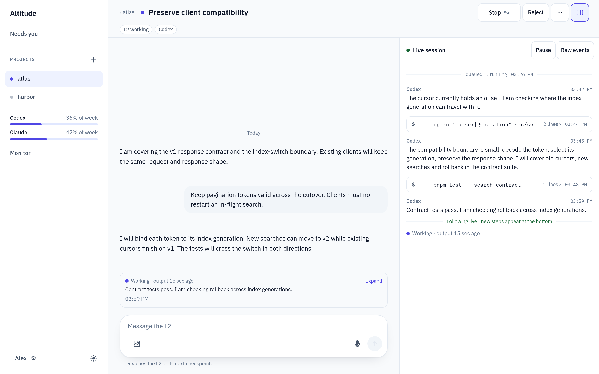
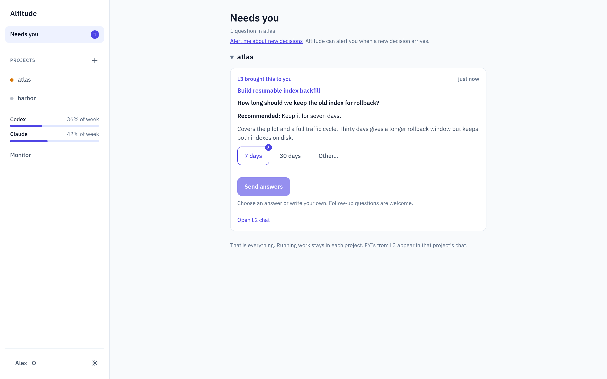

# A project through several fronts of work

**Illustrative scenario, actual interface.** Atlas is a fictional search service moving to a
versioned index; Harbor is a second fictional project. Every message, task, usage reading and
tool result below is fixture data rendered by the real web application. The captures demonstrate
the interface, not a migration that an agent actually delivered.

## Who carries the work

You set direction and make decisions that need your judgment. Each project has a persistent
coordinator (L3); each task has an owner (L2) responsible for investigation through delivery.
An owner can delegate bounded work to native helpers (L1) and remains responsible for the result.
You can talk to an owner directly as well as through the project conversation.

<picture>
  <source media="(max-width: 600px)" srcset="images/orchestration-phone.svg">
  
</picture>

## Keep the project direction in one conversation

In **Atlas**, discuss the migration with L3, the project's persistent orchestrator. Preserve the
v1 API and pagination contract, make backfill retries safe, and keep p95 latency below 200 ms.
After agreeing those constraints, ask L3 to dispatch three independent tasks:

| L2 owner | Its scope | Why it can proceed now |
| --- | --- | --- |
| Client compatibility | API responses, generation-bound cursors and contract tests | Implements against the agreed interface. |
| Resumable backfill | Revision-aware upserts, checkpoints and retry tests | Uses the agreed document/revision contract. |
| Performance baseline | Replay harness and current-index latency measurements | Establishes a baseline before the implementation changes land. |

L3 creates concrete briefs; Altitude dispatches the tasks subject to capacity and engine
availability. Each L2 investigates and owns its work end to end, choosing its implementation
and any native helpers. Coordination of dependencies is L3/owner judgment; this example does
not imply an automatic dependency scheduler. Rollout waits for the results.

<picture>
  <source media="(max-width: 600px)" srcset="images/project-phone.png">
  
</picture>

[Full-size desktop](images/project-desktop.png) · [Phone conversation](images/project-phone.png)

On desktop the work panel sits beside the project conversation. On phone, **Chat** and **Work**
show the same project in separate tabs. [Open the phone Work capture](images/work-phone.png).

## Steer a task without going through L3

Open **Preserve client compatibility** and tell its L2:

> Keep pagination tokens valid across the cutover. Clients must not restart an in-flight search.

The owner describes its generation-bound cursor design in the task conversation. The adjacent
**Live session** shows its observed replies and tool activity, with command output folded.
Messages sent here are durable and reach the worker at its engine's next checkpoint; the
conversation remains available separately from the engine transcript.

<picture>
  <source media="(max-width: 600px)" srcset="images/task-phone.png">
  
</picture>

[Full-size desktop](images/task-desktop.png) · [Phone conversation](images/task-phone.png)

On phone, use **Conversation** and **Live session** to switch panes.
[Open the phone session capture](images/session-phone.png). The capture script also sends a
fixture-only follow-up, checks that its bubble appears, and verifies that the composer clears.

For the occasional command you want to run yourself, turn on **Settings → This machine →
Terminal**. The task's panel then switches between **Live session** and **Terminal** (a third tab
on phone) and opens a shell as you in its worktree, outside the owner's sandbox. The project
header's **Terminal** opens one in the project folder. Each terminal survives navigation and lost
connections, and ends when you close it, the task finishes, the setting goes off or Altitude
restarts. Only its opening and closing are recorded. [Operator terminal](ARCHITECTURE.md#operator-terminal)
describes its lifetime and how Altitude refuses its own agents.

## Let L3 answer what the project already knows

The backfill owner asks whether a retried batch may rewrite a document. L3 answers from the
agreed contract: upsert by document ID and source revision, preserving any newer revision.
Its message requests the blocked owner's resume. You do not need to repeat that decision.

Later the owner needs a retention policy: keep the old index for seven or thirty days. L3 can
recommend seven days for the pilot, but the storage cost and rollback window need your judgment.
It escalates that question. The other task owners can continue while this one waits.

**Needs you** gathers unanswered operator questions across projects. Open a question to read its
context and discuss it in the owning L2 conversation. Pick choices, then use **Send N answers**
to submit them; even a single choice stays staged until you send it. You can also type,
“Keep the old index for seven days; include that limit in the rollout notes.” The owner records
that decision against your message. A follow-up keeps the question open, and a saved answer does
not by itself mean work has resumed or a merge hold has been released.

<picture>
  <source media="(max-width: 600px)" srcset="images/decision-phone.png">
  
</picture>

[Full-size desktop](images/decision-desktop.png) · [Phone decision](images/decision-phone.png) ·
[Watch the phone walkthrough](images/phone-walkthrough.webm)

The silent recording follows the real interface through the project, work, task and live-session
views, sends a fictional task message, then selects and sends the seven-day answer. All responses
are fixtures; it demonstrates the interaction, not live agents or voice recognition.

The [current decision boards](../design/wireframes/CONVERSATION_FIRST.md) illustrate these states;
[phone/desktop walkthroughs](DEVELOPMENT.md#browser-walkthroughs) retain implementation evidence
outside Git.

## Bring delivery back to the project

Each owner runs the project's checks and appropriate review, and delivers through its own PR.
A merge hold leaves a checked PR for your review; otherwise the owner can merge when ready.
Verification retains the report and conversation in the archive. Reports needing judgment go
to L3; a mechanically clean delivery can close automatically without another L3 turn.
Back in the project conversation, discuss whether the compatibility, backfill and performance
results justify a rollout task, or whether one needs further work first.

The scope and ordering here are an example of engineering judgment, not a prescribed pipeline.
For session identity and engine-specific message timing, see [lifecycle](SESSION_LIFECYCLE.md).
To try a project, follow [setup](SETUP.md).

## Capture source and maintenance

[Fixture data and capture instructions](../design/readme/README.md) explain how to reproduce the
images. The script builds on [Project](../web/src/routes/Project.tsx),
[Task](../web/src/routes/Task.tsx), [Live session](../web/src/routes/LiveSession.tsx) and
[Needs you](../web/src/routes/NeedsYou.tsx), with no app styling overrides or private service data.
Desktop images are 1440×900 and phone images 390×844, rendered at 2× for readable enlargement.
Open any image for its full resolution. Responsive picture sources keep phone text readable
when this page is viewed at narrow widths.
